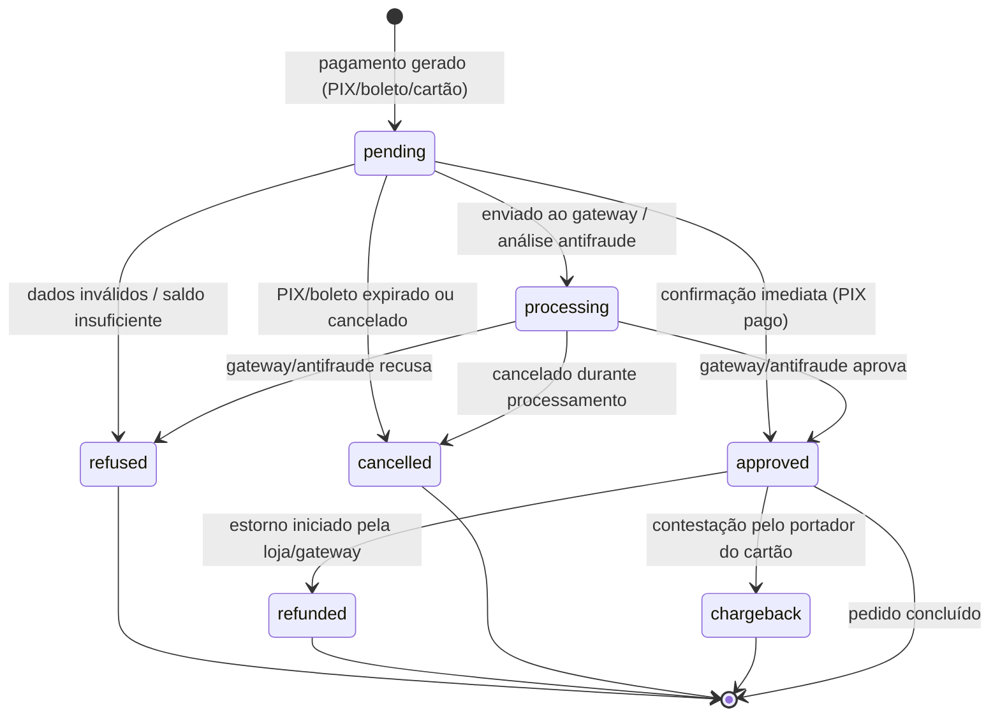

## MANDATORY: Tool Calls Required Before Answering

> **Estas chamadas são OBRIGATÓRIAS, não opcionais.** Execute-as antes de gerar
> qualquer código ou payload. Se você está respondendo sem ter chamado a
> ferramenta abaixo, **pare e chame agora**.

### 1. Buscar documentação atualizada (sempre)

```bash
node skills/tray-dev/scripts/search_docs.mjs --topic=pagamentos "<termo da pergunta>"
```

- `<TOPIC_SLUG>`: ver tabela em `skills/tray-dev/SKILL.md`.
- Use os trechos retornados como fonte primária; este SKILL.md é resumo denso.

### 2. Revisar campos (este recurso ainda NÃO tem `validate.mjs`)

> **Nota:** o recurso `pagamentos` ainda não possui `scripts/validate.mjs` local.
> A chamada **OBRIGATÓRIAS** a `search_docs.mjs` acima continua valendo. Como não
> há validador automático, **você é responsável** por revisar manualmente cada
> campo obrigatório (`order_id`, `payment_method`, `payment_type`, `amount`)
> contra a doc retornada por `search_docs.mjs` e contra os schemas de referência
> em `skills/pagamentos/schemas/` (`payment.create.json`, `payment.update.json`)
> antes de retornar qualquer código. Confira em especial: chave de recurso
> `Payment` presente no body, `payment_type` dentro do enum
> (`credit_card`/`boleto`/`pix`/`transfer`/`deposit`), `amount` como decimal com
> ponto (`299.90`, nunca `299,90`), e `installments`/`installment_value`
> coerentes com `max_installments`/`min_installment_value` de `/payments/settings`.

## Antes de responder

> Execute estas verificações antes de gerar qualquer payload ou código:

1. Confirme o método HTTP e o endpoint correto para a operação solicitada (CRUD
   em `/payments`, leitura de opções em `/payments/options`, leitura de
   configurações em `/payments/settings`).
2. Identifique os campos obrigatórios listados neste documento — na criação,
   `order_id`, `payment_method`, `payment_type` e `amount` nunca podem faltar;
   não omita nenhum.
3. Verifique que `access_token` não aparece como literal string no código gerado
   — use sempre `TRAY_ACCESS_TOKEN` e `TRAY_API_ADDRESS` por variável de
   ambiente, e SEMPRE como query parameter (`?access_token={token}`), nunca em
   header.
4. Confirme que esta é a skill correta para o recurso: pagamento é o registro
   financeiro de um pedido; se for o pedido em si leia `when_not_to_use` e
   redirecione para `tray-pedidos`; se for notificação de status, lembre que não
   há webhook `payment` (use o escopo `order` em `tray-webhooks`).

# Informações de Pagamento — API Tray

Documentação oficial: https://developers.tray.com.br/#apis-de-informacoes-de-pagamento

> **Atenção (disambiguation):** o wrapper de payload/resposta em POST/PUT é
> `Payment` (singular, PascalCase) e o endpoint base é `/payments`. Omitir o
> wrapper `Payment` é a causa #1 de `HTTP 400` neste recurso. E lembre: **não
> existe escopo de webhook `payment`** — mudanças de status chegam pelo escopo
> `order` (ver `tray-webhooks`).

## Visão geral

Um `Payment` é o registro financeiro associado a um pedido na Tray: ele descreve
como o pedido foi (ou será) pago — o método/gateway (`payment_method`), a
modalidade (`payment_type`: `credit_card`, `boleto`, `pix`, `transfer` ou
`deposit`), o valor (`amount`), o status (`pending` → `approved`/`refused`/
`refunded`/`cancelled`/`chargeback`) e os dados específicos de cada modalidade
(bandeira e últimos 4 dígitos do cartão, URL e linha digitável do boleto, QR
code e chave do PIX). O recurso expõe CRUD em `/payments` mais dois endpoints
de leitura — `/payments/options` (formas de pagamento ativas da loja, com regras
de parcelamento e desconto) e `/payments/settings` (configurações globais:
gateway, ambiente, limites de parcela, prazos de expiração de boleto/PIX e
antifraude). O uso mais comum é a **conciliação**: registrar e manter
sincronizado, contra um gateway externo, o estado de pagamento de cada pedido.

O pagamento depende de um pedido já existente: `order_id` deve apontar para um
pedido válido (ver `tray-pedidos`; consulte `GET /orders/:id/full` para o
contexto completo). Um único `order_id` pode ter **múltiplos** registros de
`Payment` (ex.: parte no cartão, parte no boleto), de modo que a conciliação
deve somar os `amount` com `status=approved`, não assumir um pagamento único.
A notificação de mudança de pagamento NÃO chega por um webhook próprio — não há
escopo `payment` na plataforma: o sinal vem pelo escopo `order` (act=update), e
o objeto de pedido traz o campo `payments_notification`; ao receber o webhook de
`order`, consulte `GET /payments?order_id={id}` ou `GET /orders/:id/full` para o
status atualizado (ver `tray-webhooks` e `tray-pedidos`). Antes de exibir formas
de pagamento ou registrar um pagamento, leia `/payments/options` e
`/payments/settings` para respeitar `max_installments`, `min_installment_value`,
`pix_minutes_to_expire` e `boleto_days_to_expire`.

Valem todas as invariantes da plataforma. O `access_token` é SEMPRE query
parameter (`?access_token={token}`) — enviá-lo em header `Authorization: Bearer`
faz a API responder `HTTP 401`. A URL base `https://{api_address}/` varia por
loja e vem do callback OAuth (use `TRAY_API_ADDRESS`); `api_address` errado gera
`HTTP 404`. Todo body de POST/PUT é envolvido na chave de recurso `Payment`
(`{"Payment": {...}}`). Valores monetários são decimais com **ponto** (`299.90`),
sem separador de milhar nem vírgula. Timestamps seguem `YYYY-MM-DD HH:MM:SS` no
horário de Brasília, sem timezone (ex.: `paid_at`). A listagem `GET /payments`
pagina no máximo **50** itens (padrão 30): itere com `paging.total`, não assuma
que a primeira página traz tudo. O rate limit é 180 req/min e 10.000 req/dia;
`HTTP 429` exige backoff exponencial (1s, 2s, 4s, 8s) — não faça polling
agressivo, reaja ao webhook de `order` e só então consulte.

## Endpoints

| Método | Endpoint | Descrição |
|:--|:--|:--|
| GET | `/payments` | Listagem de pagamentos com paginação e filtros |
| GET | `/payments/:id` | Consultar dados de um pagamento por ID |
| POST | `/payments` | Cadastrar novo pagamento (body envolto em `Payment`) |
| PUT | `/payments/:id` | Atualizar dados do pagamento (body envolto em `Payment`) |
| DELETE | `/payments/:id` | Excluir pagamento |
| GET | `/payments/options` | Listar opções/métodos de pagamento ativos na loja |
| GET | `/payments/settings` | Consultar configurações de pagamento da loja |

**Autenticação:** `?access_token={token}` como **query parameter** em todas as chamadas. Nunca em header `Authorization` (a API ignora e responde HTTP 401). URL base `https://{api_address}/` varia por loja (retornada no callback OAuth).

---

### GET /payments

Listagem de pagamentos da loja com paginação e filtros.

**Quando usar:** auditar pagamentos, conciliar com o gateway, ou filtrar por pedido/status/tipo/data. Leia `paging.total` para iterar páginas — a paginação máxima é 50 itens (padrão 30); não assuma que a primeira página traz todos os registros.

**Pré-requisitos:**

- `access_token` válido como query parameter.
- `TRAY_API_ADDRESS` da loja (varia por loja, retornado no callback OAuth).

**Schema:** sem body — apenas query params (`limit`, `page`, `order_id`, `payment_type`, `status`, `created_at`).

| Parâmetro | Tipo | Obrigatório | Descrição |
|:--|:--|:--|:--|
| `access_token` | string | Sim | Token de acesso (query param) |
| `limit` | number | Não | Itens por página (padrão 30, máx **50**) |
| `page` | number | Não | Número da página |
| `order_id` | number | Não | Filtrar por pedido |
| `payment_type` | string | Não | Filtrar por tipo (`credit_card`, `boleto`, `pix`, `transfer`, `deposit`) |
| `status` | string | Não | Filtrar por status (`pending`, `approved`, ...) |
| `created_at` | date | Não | Filtrar por data de criação (`YYYY-MM-DD`) |

**Resposta:** `paging.{total,page,offset,limit,maxLimit}` + `Payments[].Payment.{id,order_id,payment_method,payment_type,amount,installments,installment_value,status,transaction_id,card_brand,card_last_digits,paid_at,created_at,updated_at}`.

**Exemplo (curl):**

```bash
# NÃO-VERIFICADO contra sandbox — validar antes do merge.
curl -X GET "https://${TRAY_API_ADDRESS}/payments?access_token=${TRAY_ACCESS_TOKEN}&status=approved&limit=30&page=1"
```

**Exemplo (Node):**

```js
// NÃO-VERIFICADO contra sandbox — validar antes do merge.
const apiAddress = process.env.TRAY_API_ADDRESS;
const accessToken = process.env.TRAY_ACCESS_TOKEN;

const params = new URLSearchParams({
  access_token: accessToken,
  status: "approved",
  limit: "30",
  page: "1",
});

const res = await fetch(`https://${apiAddress}/payments?${params}`);
if (res.status === 429) throw new Error("Rate limit — aplicar backoff exponencial (1s, 2s, 4s, 8s)");
const data = await res.json();
console.log(`Total: ${data.paging.total}`); // iterar páginas com paging.total
```

**Erros comuns:**

| Código | Causa provável | Correção |
|:--|:--|:--|
| 401 | `access_token` expirado (3h) ou enviado em header `Authorization` em vez de query param | Renovar via `GET /auth?refresh_token={token}`; passar `?access_token={token}` |
| 404 | `api_address` incorreto (varia por loja) | Usar o `api_address` retornado no callback OAuth |
| 429 | Rate limit (180 req/min ou 10k/dia) | Backoff exponencial (1s, 2s, 4s, 8s) |
| — | Esperar todos os itens em uma chamada | Paginação máxima é 50; iterar com `paging.total` |

---

### GET /payments/:id

Consultar os dados de um pagamento específico por ID.

**Quando usar:** obter detalhes completos de um pagamento (status, `transaction_id`, dados do método) antes de atualizar ou ao diagnosticar uma transação.

**Pré-requisitos:**

- `access_token` válido.
- `id` do pagamento (obtido via `GET /payments`).

**Schema:** sem body — apenas parâmetro de path `:id`.

| Parâmetro | Tipo | Obrigatório | Descrição |
|:--|:--|:--|:--|
| `:id` | number | Sim | ID do pagamento (path) |
| `access_token` | string | Sim | Token de acesso (query param) |

**Resposta:** objeto `Payment` com todos os campos.

**Exemplo (curl):**

```bash
# NÃO-VERIFICADO contra sandbox — validar antes do merge.
curl -X GET "https://${TRAY_API_ADDRESS}/payments/800?access_token=${TRAY_ACCESS_TOKEN}"
```

**Exemplo (Node):**

```js
// NÃO-VERIFICADO contra sandbox — validar antes do merge.
const apiAddress = process.env.TRAY_API_ADDRESS;
const accessToken = process.env.TRAY_ACCESS_TOKEN;
const paymentId = 800;

const res = await fetch(
  `https://${apiAddress}/payments/${paymentId}?access_token=${accessToken}`,
);
if (res.status === 404) throw new Error("Pagamento inexistente ou api_address errado");
const data = await res.json();
console.log(data.Payment.status);
```

**Erros comuns:**

| Código | Causa provável | Correção |
|:--|:--|:--|
| 401 | Token expirado ou enviado em header | Renovar e usar query param |
| 404 | `id` de pagamento inexistente ou `api_address` errado | Confirmar `id` via listagem e `api_address` da loja |
| 429 | Rate limit | Backoff exponencial |

---

### POST /payments

Cadastrar um novo pagamento associado a um pedido. Body envolto na chave de recurso `Payment`.

**Quando usar:** registrar um pagamento para um pedido existente (PIX, boleto, cartão, transferência, depósito), tipicamente ao conciliar com um gateway externo.

**Pré-requisitos:**

- `access_token` válido.
- `order_id` de um pedido existente (ver `tray-pedidos`).
- `payment_method`, `payment_type` e `amount` definidos.
- Body envolto na chave `Payment`.

**Schema:** [`schemas/payment.create.json`](schemas/payment.create.json)

| Campo | Tipo | Obrigatório | Descrição |
|:--|:--|:--|:--|
| `order_id` | number | Sim | ID do pedido associado |
| `payment_method` | string | Sim | Nome do método/gateway (ex.: PagSeguro) |
| `payment_type` | string | Sim | Enum: `credit_card` \| `boleto` \| `pix` \| `transfer` \| `deposit` |
| `amount` | decimal | Sim | Valor; decimal com **ponto** (`299.90`), sem separador de milhar |
| `installments` | number | Não | Parcelas (cartão); respeitar `max_installments` das settings |
| `status` | string | Não | Enum: `pending` \| `processing` \| `approved` \| `refused` \| `refunded` \| `cancelled` \| `chargeback` |
| `transaction_id` | string | Não | ID da transação no gateway (conciliação) |
| `card_brand` | string | Não (`credit_card`) | Bandeira (Visa, Mastercard, Elo) |
| `card_last_digits` | string | Não (`credit_card`) | Últimos 4 dígitos; nunca o número completo (PCI-DSS) |
| `boleto_url` / `boleto_barcode` | string | Não (`boleto`) | URL e linha digitável do boleto |
| `pix_qrcode` / `pix_key` | string | Não (`pix`) | Payload copia-e-cola e chave PIX |
| `paid_at` | datetime | Não | `YYYY-MM-DD HH:MM:SS` (Brasília, sem timezone) |

**Exemplo (curl):**

```bash
# NÃO-VERIFICADO contra sandbox — validar antes do merge.
curl -X POST "https://${TRAY_API_ADDRESS}/payments?access_token=${TRAY_ACCESS_TOKEN}" \
  -H 'Content-Type: application/json' \
  -d '{"Payment":{"order_id":1001,"payment_method":"PagSeguro","payment_type":"pix","amount":"299.90","status":"pending"}}'
```

**Exemplo (Node):**

```js
// NÃO-VERIFICADO contra sandbox — validar antes do merge.
const apiAddress = process.env.TRAY_API_ADDRESS;
const accessToken = process.env.TRAY_ACCESS_TOKEN;

const body = {
  Payment: {
    order_id: 1001,
    payment_method: "PagSeguro",
    payment_type: "pix", // credit_card | boleto | pix | transfer | deposit
    amount: "299.90", // decimal com ponto, sem separador de milhar
    status: "pending",
  },
};

const res = await fetch(`https://${apiAddress}/payments?access_token=${accessToken}`, {
  method: "POST",
  headers: { "Content-Type": "application/json" },
  body: JSON.stringify(body),
});
if (res.status === 400) throw new Error("Conferir chave Payment e campos obrigatórios");
const data = await res.json();
console.log(`Criado id ${data.id}`);
```

**Erros comuns:**

| Código | Causa provável | Correção |
|:--|:--|:--|
| 400 | Faltou a chave `Payment`, campo obrigatório ausente (`order_id`/`payment_method`/`payment_type`/`amount`), ou `payment_type` fora do enum; `amount` com vírgula | Envolver em `{"Payment": {...}}`; conferir campos; usar decimal com ponto |
| 401 | Token expirado ou em header | Renovar e usar query param |
| 404 | `order_id` inexistente ou `api_address` errado | Confirmar pedido (ver `tray-pedidos`) e `api_address` |
| 429 | Rate limit | Backoff exponencial |

---

### PUT /payments/:id

Atualizar os dados de um pagamento existente (tipicamente o status e o `transaction_id`). Body envolto na chave `Payment`. Atualização parcial — envie apenas os campos a alterar.

**Quando usar:** sincronizar o status com o gateway (ex.: `pending` → `approved`), registrar `paid_at`, ou anexar `transaction_id` de conciliação.

**Pré-requisitos:**

- `access_token` válido.
- `id` do pagamento.
- Body envolto na chave `Payment`.

**Schema:** [`schemas/payment.update.json`](schemas/payment.update.json)

| Campo | Tipo | Obrigatório | Descrição |
|:--|:--|:--|:--|
| `:id` | number | Sim | ID do pagamento (path) |
| `status` | string | Não | Enum: `pending` \| `processing` \| `approved` \| `refused` \| `refunded` \| `cancelled` \| `chargeback` |
| `transaction_id` | string | Não | ID da transação no gateway |
| `paid_at` | datetime | Não | `YYYY-MM-DD HH:MM:SS` (Brasília) |
| `amount` | decimal | Não | Valor; decimal com ponto |
| `installments` | number | Não | Parcelas |
| `card_brand` | string | Não | Bandeira do cartão |
| `card_last_digits` | string | Não | Últimos 4 dígitos |

**Exemplo (curl):**

```bash
# NÃO-VERIFICADO contra sandbox — validar antes do merge.
curl -X PUT "https://${TRAY_API_ADDRESS}/payments/800?access_token=${TRAY_ACCESS_TOKEN}" \
  -H 'Content-Type: application/json' \
  -d '{"Payment":{"status":"approved","transaction_id":"PAG-123456","paid_at":"2026-03-21 14:30:00"}}'
```

**Exemplo (Node):**

```js
// NÃO-VERIFICADO contra sandbox — validar antes do merge.
const apiAddress = process.env.TRAY_API_ADDRESS;
const accessToken = process.env.TRAY_ACCESS_TOKEN;
const paymentId = 800;

const body = {
  Payment: {
    status: "approved", // pending|processing|approved|refused|refunded|cancelled|chargeback
    transaction_id: "PAG-123456",
    paid_at: "2026-03-21 14:30:00", // YYYY-MM-DD HH:MM:SS (Brasília)
  },
};

const res = await fetch(
  `https://${apiAddress}/payments/${paymentId}?access_token=${accessToken}`,
  {
    method: "PUT",
    headers: { "Content-Type": "application/json" },
    body: JSON.stringify(body),
  },
);
if (res.status === 400) throw new Error("Conferir chave Payment e status válido");
const data = await res.json();
console.log(data.message);
```

**Erros comuns:**

| Código | Causa provável | Correção |
|:--|:--|:--|
| 400 | Falta da chave `Payment` ou `status` fora do enum | Envolver em `{"Payment": {...}}`; usar status válido |
| 401 | Token expirado ou em header | Renovar e usar query param |
| 404 | `id` de pagamento inexistente | Confirmar via listagem |
| 429 | Rate limit | Backoff exponencial |

---

### DELETE /payments/:id

Excluir um pagamento por ID.

**Quando usar:** remover um registro de pagamento criado por engano. Prefira atualizar o status (`refunded`/`cancelled`) via `PUT` para preservar o histórico de conciliação.

**Pré-requisitos:**

- `access_token` válido.
- `id` do pagamento.

**Schema:** sem body — apenas parâmetro de path `:id`.

| Parâmetro | Tipo | Obrigatório | Descrição |
|:--|:--|:--|:--|
| `:id` | number | Sim | ID do pagamento (path) |
| `access_token` | string | Sim | Token de acesso (query param) |

**Exemplo (curl):**

```bash
# NÃO-VERIFICADO contra sandbox — validar antes do merge.
curl -X DELETE "https://${TRAY_API_ADDRESS}/payments/800?access_token=${TRAY_ACCESS_TOKEN}"
```

**Exemplo (Node):**

```js
// NÃO-VERIFICADO contra sandbox — validar antes do merge.
const apiAddress = process.env.TRAY_API_ADDRESS;
const accessToken = process.env.TRAY_ACCESS_TOKEN;
const paymentId = 800;

// Prefira PUT status=cancelled/refunded para preservar o histórico de conciliação.
const res = await fetch(
  `https://${apiAddress}/payments/${paymentId}?access_token=${accessToken}`,
  { method: "DELETE" },
);
if (res.status === 404) throw new Error("Pagamento inexistente ou já excluído");
const data = await res.json();
console.log(data.message);
```

**Erros comuns:**

| Código | Causa provável | Correção |
|:--|:--|:--|
| 401 | Token expirado ou em header | Renovar e usar query param |
| 404 | `id` inexistente ou já excluído | Confirmar via listagem |
| 429 | Rate limit | Backoff exponencial |

---

### GET /payments/options

Listar as opções/métodos de pagamento ativos na loja (cartão, boleto, PIX) com regras de parcelamento e desconto.

**Quando usar:** antes de exibir formas de pagamento ao cliente ou de registrar um pagamento — descobrir `max_installments`, `min_installment_value` e descontos por método.

**Pré-requisitos:**

- `access_token` válido.
- `TRAY_API_ADDRESS` da loja.

**Schema:** sem body — apenas `access_token` (query param).

| Parâmetro | Tipo | Obrigatório | Descrição |
|:--|:--|:--|:--|
| `access_token` | string | Sim | Token de acesso (query param) |

**Resposta:** `PaymentOptions[].PaymentOption.{id,name,type,active,max_installments,min_installment_value,discount}`.

**Exemplo (curl):**

```bash
# NÃO-VERIFICADO contra sandbox — validar antes do merge.
curl -X GET "https://${TRAY_API_ADDRESS}/payments/options?access_token=${TRAY_ACCESS_TOKEN}"
```

**Exemplo (Node):**

```js
// NÃO-VERIFICADO contra sandbox — validar antes do merge.
const apiAddress = process.env.TRAY_API_ADDRESS;
const accessToken = process.env.TRAY_ACCESS_TOKEN;

const res = await fetch(
  `https://${apiAddress}/payments/options?access_token=${accessToken}`,
);
const data = await res.json();
for (const { PaymentOption } of data.PaymentOptions) {
  console.log(`${PaymentOption.name}: até ${PaymentOption.max_installments}x`);
}
```

**Erros comuns:**

| Código | Causa provável | Correção |
|:--|:--|:--|
| 401 | Token expirado ou em header | Renovar e usar query param |
| 404 | `api_address` errado | Usar o do callback OAuth |
| 429 | Rate limit | Backoff exponencial |

---

### GET /payments/settings

Consultar as configurações globais de pagamento da loja (gateway, ambiente, limites de parcelamento, expiração de boleto/PIX, antifraude).

**Quando usar:** validar restrições antes de registrar pagamento — respeitar `max_installments`/`min_installment_value`, calcular vencimento de boleto (`boleto_days_to_expire`) e expiração de PIX (`pix_minutes_to_expire`).

**Pré-requisitos:**

- `access_token` válido.
- `TRAY_API_ADDRESS` da loja.

**Schema:** sem body — apenas `access_token` (query param).

| Parâmetro | Tipo | Obrigatório | Descrição |
|:--|:--|:--|:--|
| `access_token` | string | Sim | Token de acesso (query param) |

**Resposta:** `PaymentSettings.{gateway,environment,max_installments,min_installment_value,boleto_days_to_expire,pix_minutes_to_expire,anti_fraud_enabled}`.

**Exemplo (curl):**

```bash
# NÃO-VERIFICADO contra sandbox — validar antes do merge.
curl -X GET "https://${TRAY_API_ADDRESS}/payments/settings?access_token=${TRAY_ACCESS_TOKEN}"
```

**Exemplo (Node):**

```js
// NÃO-VERIFICADO contra sandbox — validar antes do merge.
const apiAddress = process.env.TRAY_API_ADDRESS;
const accessToken = process.env.TRAY_ACCESS_TOKEN;

const res = await fetch(
  `https://${apiAddress}/payments/settings?access_token=${accessToken}`,
);
const { PaymentSettings } = await res.json();
console.log(`PIX expira em ${PaymentSettings.pix_minutes_to_expire} min`);
console.log(`Boleto vence em ${PaymentSettings.boleto_days_to_expire} dias`);
```

**Erros comuns:**

| Código | Causa provável | Correção |
|:--|:--|:--|
| 401 | Token expirado ou em header | Renovar e usar query param |
| 404 | `api_address` errado | Usar o do callback OAuth |
| 429 | Rate limit | Backoff exponencial |

## Edge cases

### **Notificação de pagamento não tem escopo de webhook próprio**

A Tray **não** possui escopo de webhook `payment`. Apesar do que sugerem boas práticas antigas, nenhuma notificação de pagamento chega por um escopo dedicado. Alterações de status de pagamento são sinalizadas via escopo `order` (`act=update`): o objeto de pedido carrega o campo `payments_notification` com a URL e os dados de pagamento.

**Exemplo concreto:** um PIX do pedido `1001` muda de `pending` para `approved`. Você **não** recebe um webhook `payment_update` — recebe um webhook `order` com `scope_name=order`, `scope_id=1001`, `act=update`. Ao receber, consulte o status real:

```bash
# NÃO-VERIFICADO contra sandbox — validar antes do merge.
curl -X GET "https://${TRAY_API_ADDRESS}/payments?access_token=${TRAY_ACCESS_TOKEN}&order_id=1001"
# ou, para o pedido completo com pagamento embutido:
curl -X GET "https://${TRAY_API_ADDRESS}/orders/1001/full?access_token=${TRAY_ACCESS_TOKEN}"
```

Consulte `tray-webhooks` (configuração do escopo `order`) e `tray-pedidos` (`/orders/:id/full`).

### **Múltiplos pagamentos por pedido**

Um único `order_id` pode ter **vários** registros de `Payment` — por exemplo, parte no cartão de crédito e parte no boleto, ou uma tentativa recusada seguida de outra aprovada. Não assuma um pagamento único por pedido ao conciliar.

**Exemplo concreto:** o pedido `2050` tem dois pagamentos:

```json
{
  "Payments": [
    { "Payment": { "id": "900", "order_id": "2050", "payment_type": "credit_card", "amount": "200.00", "status": "approved" } },
    { "Payment": { "id": "901", "order_id": "2050", "payment_type": "boleto", "amount": "99.90", "status": "approved" } }
  ]
}
```

Para o valor efetivamente pago, **filtre por `status=approved` e some os `amount`** (`200.00 + 99.90 = 299.90`), em vez de ler apenas o primeiro registro. Uma tentativa anterior com `status=refused` deve ser ignorada na soma.

### **PIX e boleto expiram — não deixe pendentes indefinidamente**

Um PIX com `status=pending` além de `pix_minutes_to_expire` minutos, ou um boleto além de `boleto_days_to_expire` dias, **não será mais pago**. Manter esses registros como `pending` para sempre distorce relatórios e bloqueia estoque reservado.

**Exemplo concreto:** consulte os prazos antes de gerar a cobrança e calcule a janela de expiração:

```bash
# NÃO-VERIFICADO contra sandbox — validar antes do merge.
curl -X GET "https://${TRAY_API_ADDRESS}/payments/settings?access_token=${TRAY_ACCESS_TOKEN}"
# Resposta: { "PaymentSettings": { "pix_minutes_to_expire": 30, "boleto_days_to_expire": 3, ... } }
```

Com `pix_minutes_to_expire: 30`, um PIX criado às `2026-06-17 14:00:00` expira às `2026-06-17 14:30:00`. Após esse horário, trate o pagamento como expirado (atualize via `PUT /payments/:id` para `cancelled`) em vez de mantê-lo `pending`.

### **Parcelamento inválido é rejeitado — valide antes de enviar**

Enviar `installments` acima de `max_installments`, ou um valor de parcela abaixo de `min_installment_value`, é rejeitado pelo gateway/loja — às vezes silenciosamente, sem mensagem clara. Consulte `/payments/options` ou `/payments/settings` antes de registrar.

**Exemplo concreto:** a loja retorna `max_installments: 12` e `min_installment_value: "10.00"`. Para `amount: "299.90"`:

```text
299.90 / 12 = 24.99  → válido (>= 10.00)
299.90 / 30 = 9.99   → INVÁLIDO: 30 > max_installments (12) e 9.99 < min_installment_value (10.00)
```

Calcule `amount / installments >= min_installment_value` **e** `installments <= max_installments` no cliente antes do `POST /payments`.

### **`amount` com vírgula ou separador de milhar quebra a requisição**

A API espera decimal com **ponto** e **sem separador de milhar**. Enviar `"299,90"` ou `"1.299,90"` causa `HTTP 400` ou interpretação incorreta do valor.

**Exemplo concreto:**

```text
"299.90"    → correto
"299,90"    → ERRADO (vírgula decimal) → HTTP 400 ou valor incorreto
"1.299,90"  → ERRADO (separador de milhar + vírgula) → deve ser "1299.90"
```

Normalize sempre para ponto decimal sem separador de milhar antes de montar o body `{"Payment": {...}}`.

### **Estorno e chargeback são estados terminais distintos**

`refunded` é um estorno **iniciado pela loja/gateway**; `chargeback` é uma contestação **iniciada pelo portador do cartão** junto à adquirente. Tratar ambos genericamente como "cancelado" corrompe a conciliação financeira e os relatórios.

**Exemplo concreto:** dois pagamentos terminam fora de `approved`:

```json
{ "Payment": { "id": "910", "status": "refunded" } }   // estorno voluntário da loja
{ "Payment": { "id": "911", "status": "chargeback" } }  // contestação do cliente na adquirente
```

O `910` reduz receita de forma controlada; o `911` pode exigir **defesa junto à adquirente** e gerar taxa. Mantenha-os como status distintos — nunca colapse para `cancelled`.

### **Paginação máxima de 50 — itere para conciliar o dia inteiro**

`GET /payments` retorna no máximo **50** itens por página (padrão **30**). Para conciliar todos os pagamentos de um dia, **itere** usando `paging.total`; não assuma que a primeira página traz tudo.

**Exemplo concreto:** com `paging.total = 137` e `limit=50`, são necessárias 3 páginas:

```bash
# NÃO-VERIFICADO contra sandbox — validar antes do merge.
# page 1..3 (50 + 50 + 37 = 137)
curl -X GET "https://${TRAY_API_ADDRESS}/payments?access_token=${TRAY_ACCESS_TOKEN}&created_at=2026-06-17&limit=50&page=1"
curl -X GET "https://${TRAY_API_ADDRESS}/payments?access_token=${TRAY_ACCESS_TOKEN}&created_at=2026-06-17&limit=50&page=2"
curl -X GET "https://${TRAY_API_ADDRESS}/payments?access_token=${TRAY_ACCESS_TOKEN}&created_at=2026-06-17&limit=50&page=3"
```

Pare quando `page * limit >= paging.total`.

## Antipadrões

- ❌ **Configurar um webhook de escopo `payment`:** esse escopo **não existe** na Tray, então o ticket de suporte é negado e nenhuma notificação chega — sua integração fica esperando eventos que nunca vêm. **Correção:** assine o escopo `order` (`act=update`) e, ao receber, leia `payments_notification` no objeto de pedido ou consulte `GET /payments?order_id={id}` para obter o status atualizado (ver `tray-webhooks`).

- ❌ **Armazenar o número completo do cartão (PAN) ou o CVV:** viola PCI-DSS e expõe a loja a sanções e vazamento — além disso a API **nunca retorna** esses dados, então não há de onde copiá-los legitimamente. **Correção:** persista apenas `card_brand` e `card_last_digits`; use `transaction_id` como chave de conciliação com o gateway.

- ❌ **Passar o `access_token` em header `Authorization: Bearer ...`:** a API Tray **ignora** o header e responde `HTTP 401`, fazendo a requisição parecer um problema de credencial quando o token está correto. **Correção:** envie o token **sempre** como query parameter — `?access_token=${TRAY_ACCESS_TOKEN}` — em toda chamada, incluindo POST/PUT/DELETE.

- ❌ **Esquecer a chave de recurso `Payment` no body de POST/PUT:** enviar os campos no nível raiz (`{"order_id":1001,...}`) é a causa #1 de `HTTP 400` neste recurso — a API não encontra o objeto esperado. **Correção:** envolva sempre o payload: `{"Payment": { "order_id": 1001, "payment_type": "pix", "amount": "299.90" }}`.

- ❌ **Fazer polling agressivo de `GET /payments` para detectar mudança de status:** repetir a chamada em loop curto estoura o rate limit (180 req/min, 10k/dia) e gera `HTTP 429`, atrasando justamente a conciliação que você queria acelerar. **Correção:** reaja ao webhook de `order` (`act=update`) e só então consulte o pagamento; em `429`, aplique backoff exponencial (1s, 2s, 4s, 8s).

- ❌ **Excluir (`DELETE /payments/:id`) um pagamento para "cancelá-lo":** apagar o registro destrói o histórico de conciliação e o `transaction_id`, impossibilitando auditoria e defesa de chargeback. **Correção:** atualize o status para `cancelled` ou `refunded` via `PUT /payments/:id`, preservando o registro e o `transaction_id`.

- ❌ **Tratar `refunded` e `chargeback` como o mesmo "cancelado":** colapsar os dois estados terminais distorce a conciliação financeira — o chargeback pode gerar taxa da adquirente e exigir contestação, o estorno não. **Correção:** mantenha cada status separado nos relatórios e dispare o fluxo de defesa específico para `chargeback`.

## State machine

O `status` do pagamento evolui conforme o gateway processa a transação e a loja faz conciliação. Estados terminais (`approved` pode reabrir via estorno/contestação; `refunded`, `cancelled` e `chargeback` encerram o ciclo financeiro). **Atenção:** não existe escopo de webhook `payment` na Tray — toda mudança de status de pagamento é sinalizada via escopo de webhook `order` (`act=update`), e o status atualizado é obtido consultando `GET /payments?order_id={id}` ou `GET /orders/:id/full` (ver `tray-webhooks` e `tray-pedidos`).



### Transições de status

| De | Para | Gatilho | Webhook |
|:--|:--|:--|:--|
| _(inicial)_ | `pending` | Pagamento gerado para o pedido (PIX/boleto recém-emitido ou cartão aguardando captura) | `order` `act=insert`/`update` → consultar `GET /payments?order_id={id}` |
| `pending` | `processing` | Transação enviada ao gateway; análise antifraude em curso (`anti_fraud_enabled=true` nas settings) | `order` `act=update` → reconsultar pagamento |
| `pending` | `approved` | Confirmação imediata (ex.: PIX pago dentro de `pix_minutes_to_expire`) | `order` `act=update` → reconsultar pagamento |
| `pending` | `refused` | Emissor/gateway recusa (dados inválidos, saldo/limite insuficiente) | `order` `act=update` |
| `pending` | `cancelled` | PIX expira após `pix_minutes_to_expire` ou boleto após `boleto_days_to_expire`; ou cancelamento manual | `order` `act=update` |
| `processing` | `approved` | Gateway/antifraude libera a transação | `order` `act=update` |
| `processing` | `refused` | Gateway/antifraude rejeita a transação | `order` `act=update` |
| `processing` | `cancelled` | Cancelamento durante o processamento | `order` `act=update` |
| `approved` | `refunded` | Estorno iniciado pela loja/gateway (`PUT /payments/:id` com `status=refunded`) | `order` `act=update` |
| `approved` | `chargeback` | Contestação aberta pelo portador do cartão junto à adquirente | `order` `act=update` |

> **Estados terminais:** `refused`, `refunded`, `cancelled` e `chargeback` não transicionam para outros estados pela API. Para "cancelar" um pagamento, **atualize o `status` via `PUT /payments/:id`** (`cancelled`/`refunded`) preservando `transaction_id` — **nunca** use `DELETE`, que apaga o histórico de conciliação.
> **`refunded` ≠ `chargeback`:** `refunded` é estorno voluntário pela loja/gateway; `chargeback` é contestação do portador junto à adquirente e pode exigir defesa/documentação. Trate-os separadamente na conciliação financeira — não os agrupe como "cancelado".
> **Múltiplos pagamentos por pedido:** um mesmo `order_id` pode ter vários `Payment` (ex.: parte em cartão, parte em boleto), cada um com sua própria máquina de estados. Ao conciliar, filtre por `status=approved` e some os `amount` aprovados em vez de assumir um único pagamento.


## Webhooks relacionados

> **Atenção (armadilha #1 deste recurso):** **NÃO existe escopo de webhook `payment` na Tray.** Não adianta abrir ticket de suporte pedindo notificação de pagamento — o escopo não existe e nenhuma notificação chegará. Mudanças de status de pagamento são sinalizadas **pelo escopo `order`** (ação `update`).

O fluxo correto para reagir a um pagamento é orientado pelo pedido, não pelo pagamento:

| Escopo | Ações | Como afeta este recurso | Ver |
|:--|:--|:--|:--|
| `order` | `insert`, `update` | Único canal de notificação de pagamento. Quando o status de um pagamento muda (ex.: `pending` → `approved` após o gateway confirmar), a Tray dispara `order` com `act=update`. O objeto de pedido traz o campo `payments_notification` com a URL/dados de pagamento. | [`tray-webhooks`](../webhooks/SKILL.md), [`tray-pedidos`](../pedidos/SKILL.md) |
| `payment` | — | **Não existe.** Não configure; o ticket será negado e nada chegará. | — |

Padrão de reação recomendado (evita polling e estouro de rate limit):

1. Receba o webhook de `order` (`act=update`) — responda `HTTP 200` imediatamente e enfileire o evento (processamento assíncrono).
2. Valide o `seller_id` para confirmar que o evento é da loja esperada (idempotência: o mesmo evento pode chegar mais de uma vez).
3. Só então consulte o status atualizado via `GET /payments?order_id={scope_id}&access_token={token}` **ou** `GET /orders/:id/full` (que já traz o bloco de pagamento). **Nunca** faça polling agressivo de `GET /payments` para detectar mudança — isso estoura o rate limit (180 req/min / 10k dia → `HTTP 429`).
4. Em `429`, aplique backoff exponencial (1s, 2s, 4s, 8s).

> Lembre-se de que um único `order_id` pode ter **múltiplos** registros de `Payment` (parte no cartão, parte no boleto) — ao reagir ao webhook, some os `amount` com `status=approved` em vez de assumir um único pagamento.

## Glossário

| Termo | Definição |
|:--|:--|
| `Payment` (wrapper) | Chave de recurso PascalCase singular que envolve **todo** body de `POST`/`PUT`: `{"Payment": {...}}`. Omiti-la é a causa #1 de `HTTP 400` neste recurso. |
| `payment_type` | Modalidade do pagamento: `credit_card`, `boleto`, `pix`, `transfer` ou `deposit`. Determina quais campos específicos se aplicam (ex.: `pix_qrcode` para PIX, `boleto_url` para boleto, `card_brand`/`card_last_digits` para cartão). |
| `payment_method` | Nome do método/gateway que processou o pagamento (ex.: `PagSeguro`). Diferente de `payment_type` (a modalidade). |
| `transaction_id` | Identificador da transação no gateway externo. Chave de **conciliação** entre a Tray e o provedor de pagamento. |
| `payments_notification` | Campo presente no objeto de **pedido** (não no de pagamento) com a URL/dados de notificação de pagamento. É por aqui — via escopo de webhook `order` — que mudanças de pagamento são sinalizadas, já que não há escopo `payment`. |
| `installments` / `installment_value` | Número de parcelas e valor de cada parcela (cartão). Limitados por `max_installments` e `min_installment_value` das configurações da loja (`GET /payments/settings`). |
| `max_installments` | Teto de parcelas por método de pagamento, retornado em `/payments/options` e `/payments/settings`. |
| `min_installment_value` | Valor mínimo permitido por parcela; impede parcelamentos com valor de parcela muito baixo. |
| `pix_minutes_to_expire` | Janela em minutos durante a qual um PIX gerado pode ser pago; após isso o pagamento expira (config em `/payments/settings`). |
| `boleto_days_to_expire` | Prazo em dias até o vencimento do boleto (config em `/payments/settings`). |
| `refunded` | Estorno do pagamento iniciado pela loja/gateway. Estado **terminal**, distinto de `chargeback` e de `cancelled`. |
| `chargeback` | Contestação de pagamento iniciada pelo portador do cartão junto à adquirente. Estado **terminal** distinto de `refunded` — a conciliação financeira difere e pode exigir contestação junto à adquirente. |
| `anti_fraud_enabled` | Flag em `PaymentSettings` indicando se a loja tem análise antifraude ativa, o que pode manter pagamentos em `processing` antes de `approved`. |
| `card_last_digits` | Últimos 4 dígitos do cartão. **NUNCA** armazene o PAN completo nem o CVV (PCI-DSS) — persista apenas `card_brand` e `card_last_digits`. |

## Referências

- Doc oficial: https://developers.tray.com.br/#apis-de-informacoes-de-pagamento
- Skills relacionadas:
  - [`tray-pedidos`](../pedidos/SKILL.md) — `order_id` obrigatório na criação de pagamento; `GET /orders/:id/full` traz o bloco de pagamento; cancelamento/ciclo de vida do pedido.
  - [`tray-webhooks`](../webhooks/SKILL.md) — único canal de notificação de pagamento é o escopo `order` (`act=update`); leitura de `payments_notification`; idempotência e resposta `HTTP 200` imediata.
  - [`tray-clientes`](../clientes/SKILL.md) — o pedido associado ao pagamento referencia um `client_id`.
  - [`tray-cupons`](../cupons/SKILL.md) — descontos por código aplicados no checkout aparecem como `discount`/`coupon_code` no pedido, afetando o `amount` do pagamento.
  - [`tray-frete`](../frete/SKILL.md) — o `shipping_cost` compõe o valor total cobrado.
- Skill de entrada e invariantes: [`tray-visao-geral`](../visao-geral/SKILL.md)
- Issue de origem: ai/tasks#100 (P2.1 — Aprofundar skills mais finas, Fase 2).

## Como Usar no Claude Code

### Exemplos de Prompt

- "lista os métodos de pagamento disponíveis na loja com limites de parcelamento"
- "consulta todos os pagamentos aprovados de hoje paginando até o fim"
- "registra um pagamento via PIX de R$ 299,90 para o pedido 1001"
- "atualiza o pagamento 800 para `approved` e registra o `transaction_id` do gateway"
- "implementa a conciliação dos pagamentos da Tray com meu gateway por `transaction_id`"
- "como recebo notificação de mudança de status de pagamento na Tray?" (resposta: via escopo `order`, não há escopo `payment`)
- "estorna o pagamento do pedido 1001" (resposta: `PUT` para `status=refunded`, não `DELETE`)

### O que o Claude faz

1. Identifica a operação (listar, consultar, criar, atualizar, excluir, ou ler opções/configurações) e o endpoint correto.
2. Consulta `GET /payments/options` e/ou `GET /payments/settings` antes de registrar pagamento, para respeitar `max_installments`, `min_installment_value`, `boleto_days_to_expire` e `pix_minutes_to_expire`.
3. Gera o body envolto na chave de recurso `Payment`, com os campos específicos da modalidade (`pix_qrcode` para PIX, `boleto_url`/`boleto_barcode` para boleto, `card_brand`/`card_last_digits` para cartão).
4. Normaliza `amount` para decimal com ponto e sem separador de milhar (`"299.90"`, nunca `"299,90"` ou `"1.299,90"`).
5. Passa `access_token` sempre como query param (`?access_token={token}`), nunca em header; lê tokens de `TRAY_ACCESS_TOKEN`/`TRAY_API_ADDRESS` via env.
6. Em listagens, pagina com `limit` (máx 50) lendo `paging.total`; em `HTTP 429`, aplica backoff exponencial.
7. Para receber status de pagamento, configura o webhook de escopo `order` (não `payment`) e consulta `GET /payments?order_id={id}` ou `GET /orders/:id/full` após o evento.
8. Para "cancelar/estornar", orienta `PUT` com `status=cancelled`/`refunded` (preserva histórico) em vez de `DELETE`.

### O que você recebe

- Código de listagem de opções (`/payments/options`) e configurações (`/payments/settings`) da loja, com leitura dos limites de parcelamento e expiração.
- Código de criação de pagamento com wrapper `{"Payment": {...}}` e campos específicos por tipo (PIX, boleto, cartão), validando contra os limites das settings.
- Código de atualização de status (`pending` → `approved`) com `transaction_id` e `paid_at` no formato `YYYY-MM-DD HH:MM:SS` (Brasília).
- Filtros de consulta por `order_id`, `payment_type`, `status` e `created_at`, com paginação por `paging.total`.
- Lógica de conciliação por `transaction_id`, somando `amount` aprovados quando o pedido tem múltiplos pagamentos.
- Tratamento de PIX/boleto expirados e distinção entre `refunded` (estorno pela loja) e `chargeback` (contestação pelo portador).
- Todos os exemplos marcados `# NÃO-VERIFICADO contra sandbox — validar antes do merge.` e sem tokens literais.

### Pré-requisitos

- `access_token` válido configurado via `TRAY_ACCESS_TOKEN` (expira em 3h — renovar via `GET /auth?refresh_token={token}`).
- `TRAY_API_ADDRESS` da loja (varia por loja, retornado no callback OAuth).
- `order_id` de um pedido existente para registrar pagamento (ver [`tray-pedidos`](../pedidos/SKILL.md)).
- Gateway de pagamento configurado na loja Tray (consulte `GET /payments/settings` para `gateway`/`environment`).
- Nunca armazenar PAN completo ou CVV (PCI-DSS) — apenas `card_brand` e `card_last_digits`.
