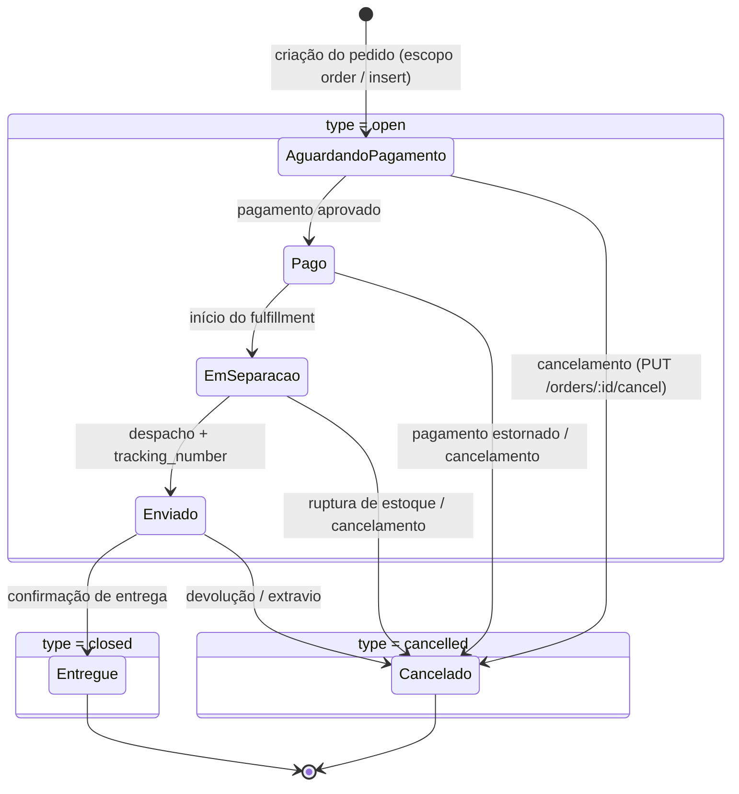

## MANDATORY: Tool Calls Required Before Answering

> **Estas chamadas são OBRIGATÓRIAS, não opcionais.** Execute-as antes de gerar
> qualquer código ou payload. Se você está respondendo sem ter chamado a
> ferramenta abaixo, **pare e chame agora**.

### 1. Buscar documentação atualizada (sempre)

```bash
node skills/tray-dev/scripts/search_docs.mjs --topic=status-pedido "<termo da pergunta>"
```

- `<TOPIC_SLUG>`: ver tabela em `skills/tray-dev/SKILL.md`.
- Use os trechos retornados como fonte primária; este SKILL.md é resumo denso.

### 2. Revisar campos (este recurso ainda NÃO tem `validate.mjs`)

> **Nota:** o recurso `status-pedido` ainda não possui `scripts/validate.mjs`
> local. A chamada **OBRIGATÓRIA** a `search_docs.mjs` acima continua valendo.
> Como não há validador automático, **você é responsável** por revisar
> manualmente cada campo obrigatório contra a doc retornada por
> `search_docs.mjs` e contra os schemas de referência em
> `skills/status-pedido/schemas/` antes de retornar qualquer código. Confira em
> especial: chave de recurso `OrderStatus` presente no body, `name` preenchido,
> `type` dentro do enum (`open`/`closed`/`cancelled`) e cores em hexadecimal
> completo `#RRGGBB`.

## Antes de responder

> Execute estas verificações antes de gerar qualquer payload ou código:

1. Confirme o método HTTP e o endpoint correto para a operação solicitada
   (CRUD em `/orders/statuses`). Confirme também que o pedido é sobre o
   CATÁLOGO de status, e não sobre mudar o status de um pedido individual
   (esse caso é `tray-pedidos`, `PUT /orders/:id`).
2. Identifique os campos obrigatórios listados neste documento — `name` nunca
   pode faltar na criação; não omita nenhum.
3. Verifique que `access_token` não aparece como literal string no código
   gerado — use sempre `TRAY_ACCESS_TOKEN` e `TRAY_API_ADDRESS` por variável
   de ambiente, passado como query param.
4. Confirme que esta é a skill correta para o recurso (leia `when_not_to_use`
   no frontmatter); status padrão da plataforma não podem ser editados nem
   excluídos.

# API de Status de Pedido — Tray

Documentação oficial: https://developers.tray.com.br/#api-de-status-do-pedido

> **Atenção (disambiguation):** este recurso gerencia o **catálogo** de tipos de
> status da loja (`/orders/statuses`), com wrapper `OrderStatus`. Para mudar o
> status atribuído a um pedido específico, use `tray-pedidos`
> (`PUT /orders/:id`, campo `status_id`) — **não** há endpoint aqui para isso.
> Confundir os dois é a causa #1 de chamada ao endpoint errado neste recurso.

## Visão geral

Um status de pedido neste recurso é uma entrada do **catálogo de status** da
loja: um tipo/configuração reutilizável (nome, descrição, cores e tipo de
fluxo) que pode ser atribuído a pedidos. A API expõe cinco endpoints de CRUD
(`GET /orders/statuses`, `GET /orders/statuses/:id`, `POST /orders/statuses`,
`PUT /orders/statuses/:id`, `DELETE /orders/statuses/:id`) e permite ao
desenvolvedor montar um pipeline próprio (ex.: Aguardando Pagamento → Pago →
Em Separação → Despachado → Entregue), definindo `name`, `description`,
`background_color`, `font_color` e `type`. A Tray pré-configura status padrão
imutáveis; a personalização é feita **criando novos** status, nunca editando ou
excluindo os padrão.

O recurso se conecta diretamente a `tray-pedidos`: cada pedido carrega um campo
`status_id` que aponta para o `id` de um status deste catálogo, e é em
`PUT /orders/:id` (não aqui) que se muda o status de um pedido individual. O
fluxo típico é descobrir os IDs via `GET /orders/statuses`, criar status
personalizados quando necessário e então atribuí-los aos pedidos via
`tray-pedidos`. A mudança de status de um pedido dispara o webhook de escopo
`order` (ação `update`, ver `tray-webhooks`) — **não existe** webhook próprio
para o catálogo de status: criar/editar/excluir um tipo de status não gera
notificação. Os IDs e o `type` deste catálogo também alimentam relatórios e
filtros de listagem de pedidos.

Invariantes da plataforma que valem para **toda** chamada deste recurso:
(1) o `access_token` é passado **sempre como query parameter**
(`?access_token={token}`), nunca em header `Authorization` — token em header
retorna `HTTP 401`; (2) a URL base é `https://{api_address}/`, e o
`api_address` **varia por loja** (retornado no callback OAuth) — usar o
endereço errado retorna `HTTP 404`; (3) todo body de `POST`/`PUT` deve estar
envolto na chave de recurso `OrderStatus` — esquecer o wrapper é a causa #1 de
`HTTP 400`; (4) listagens paginam com `limit` (padrão 30, **máximo 50**) e
`page`, lendo `paging.total` para iterar; (5) datas usam `YYYY-MM-DD` e
timestamps `YYYY-MM-DD HH:MM:SS` (horário de Brasília); (6) o rate limit é 180
req/min e 10.000 req/dia — `HTTP 429` exige backoff exponencial (1s, 2s, 4s,
8s). Como o recurso ainda não tem `validate.mjs`, valide manualmente `name`
(obrigatório), `type` (`open`/`closed`/`cancelled`) e as cores em hexadecimal
`#RRGGBB` antes de enviar.


### GET /orders/statuses

- **Quando usar:** para descobrir os IDs e os tipos (`open`/`closed`/`cancelled`) dos status já existentes na loja antes de criar um status novo, vincular um status a um pedido (via `tray-pedidos` `PUT /orders/:id`) ou auditar o pipeline de pedido da loja. É o ponto de partida para qualquer operação neste recurso — o `id` retornado aqui alimenta as chamadas `GET/PUT/DELETE /orders/statuses/:id`.
- **Pré-requisitos:**
  - `access_token` válido como query param (`?access_token={token}`).
  - `TRAY_API_ADDRESS` da loja (varia por loja, retornado no callback OAuth).
- **Schema do request:** sem body — apenas query params de paginação: `limit` (padrão 30, máximo 50) e `page`; leia `paging.total` para iterar.
- **Schema da response:** resposta JSON padrão da API Tray (ver exemplo abaixo).
- **Paginação:** `limit` (padrão 30, máximo 50), `page`.
- **Campos da resposta:**

  | Campo | Tipo | Descrição |
  |:--|:--|:--|
  | `paging.total` | integer | Total de status disponíveis |
  | `paging.page` | integer | Página atual |
  | `paging.limit` | integer | Itens por página solicitados |
  | `paging.maxLimit` | integer | Teto de itens por página (50) |
  | `OrderStatuses[].OrderStatus.id` | string | ID do status (read-only) |
  | `OrderStatuses[].OrderStatus.name` | string | Nome do status exibido no painel/acompanhamento |
  | `OrderStatuses[].OrderStatus.description` | string | Descrição detalhada do status |
  | `OrderStatuses[].OrderStatus.background_color` | string | Cor de fundo (`#RRGGBB`) |
  | `OrderStatuses[].OrderStatus.font_color` | string | Cor da fonte (`#RRGGBB`) |
  | `OrderStatuses[].OrderStatus.type` | string | `open` / `closed` / `cancelled` |

- **Exemplo (curl):**

  ```bash
  # NÃO-VERIFICADO contra sandbox — validar antes do merge.
  curl -X GET \
    "https://${TRAY_API_ADDRESS}/orders/statuses?access_token=${TRAY_ACCESS_TOKEN}&limit=30&page=1"
  ```

- **Exemplo (Node):**

  ```js
  // NÃO-VERIFICADO contra sandbox — validar antes do merge.
  const res = await fetch(
    `https://${process.env.TRAY_API_ADDRESS}/orders/statuses` +
      `?access_token=${process.env.TRAY_ACCESS_TOKEN}&limit=30&page=1`,
  );
  if (res.status === 429) { /* backoff exponencial: 1s, 2s, 4s, 8s */ }
  const data = await res.json();
  // data.paging.total para paginar; data.OrderStatuses[].OrderStatus
  ```

- **Erros comuns:**

  | Código | Causa | Como resolver |
  |:--|:--|:--|
  | 401 | `access_token` expirado (3h) ou enviado como header `Authorization` em vez de query param | Renovar via `GET /auth?refresh_token={token}`; sempre passar `?access_token={token}` na query string |
  | 404 | `api_address` incorreto (varia por loja) | Usar o `api_address` retornado no callback OAuth da loja |
  | 429 | Rate limit (180 req/min ou 10k/dia) | Backoff exponencial (1s, 2s, 4s, 8s) |

### GET /orders/statuses/:id

- **Quando usar:** para obter a configuração completa (nome, descrição, cores, tipo) de um único status antes de editá-lo ou para diagnosticar como ele aparece no painel/acompanhamento do pedido.
- **Pré-requisitos:**
  - `access_token` válido.
  - `id` do status (obtido via `GET /orders/statuses`).
- **Schema do request:** sem body — apenas parâmetro de path `:id`.
- **Schema da response:** resposta JSON padrão da API Tray (ver exemplo abaixo).
- **Campos da resposta:**

  | Campo | Tipo | Descrição |
  |:--|:--|:--|
  | `OrderStatus.id` | string | ID do status |
  | `OrderStatus.name` | string | Nome do status |
  | `OrderStatus.description` | string | Descrição detalhada |
  | `OrderStatus.background_color` | string | Cor de fundo (`#RRGGBB`) |
  | `OrderStatus.font_color` | string | Cor da fonte (`#RRGGBB`) |
  | `OrderStatus.type` | string | `open` / `closed` / `cancelled` |

- **Exemplo (curl):**

  ```bash
  # NÃO-VERIFICADO contra sandbox — validar antes do merge.
  curl -X GET \
    "https://${TRAY_API_ADDRESS}/orders/statuses/15?access_token=${TRAY_ACCESS_TOKEN}"
  ```

- **Exemplo (Node):**

  ```js
  // NÃO-VERIFICADO contra sandbox — validar antes do merge.
  const statusId = 15;
  const res = await fetch(
    `https://${process.env.TRAY_API_ADDRESS}/orders/statuses/${statusId}` +
      `?access_token=${process.env.TRAY_ACCESS_TOKEN}`,
  );
  if (res.status === 404) { /* id inexistente ou api_address errado */ }
  const data = await res.json();
  // data.OrderStatus
  ```

- **Erros comuns:**

  | Código | Causa | Como resolver |
  |:--|:--|:--|
  | 401 | Token expirado ou enviado em header | Renovar token; usar query param |
  | 404 | ID de status inexistente ou `api_address` errado | Confirmar o `id` via `GET /orders/statuses` e o `api_address` da loja |
  | 429 | Rate limit (180 req/min ou 10k/dia) | Backoff exponencial (1s, 2s, 4s, 8s) |

### POST /orders/statuses

- **Quando usar:** ao montar um pipeline de pedido próprio da loja (ex.: "Em Separação", "Aguardando Retirada", "Despachado"), definindo nome, descrição, cores hexadecimais e o `type` que classifica o comportamento no fluxo do pedido.
- **Pré-requisitos:**
  - `access_token` válido.
  - `name` definido (campo obrigatório).
  - body envolto na chave de recurso `OrderStatus`.
  - `type` coerente com o comportamento desejado (`open`/`closed`/`cancelled`).
- **Schema do request:** `schemas/order_status.update.json`
- **Schema da response:** resposta JSON padrão da API Tray (ver exemplo abaixo).
- **Content-Type:** `application/json` com a chave de recurso `"OrderStatus"`.
- **Campos:**

  | Campo | Tipo | Obrigatório | Descrição |
  |:--|:--|:--:|:--|
  | `name` | string | Sim | Nome do status, exibido no painel e no acompanhamento do pedido pelo cliente (ex.: "Em Separação") |
  | `description` | string | Não | Descrição detalhada do significado do status |
  | `background_color` | string | Não | Cor de fundo no painel — hexadecimal completo `#RRGGBB` (ex.: `#3498DB`) |
  | `font_color` | string | Não | Cor da fonte no painel — hexadecimal `#RRGGBB`; deve contrastar com `background_color` |
  | `type` | string | Não | Comportamento no fluxo: `open` (em andamento) / `closed` (finalizado) / `cancelled` (cancelado) |

- **Exemplo (curl):**

  ```bash
  # NÃO-VERIFICADO contra sandbox — validar antes do merge.
  curl -X POST \
    "https://${TRAY_API_ADDRESS}/orders/statuses?access_token=${TRAY_ACCESS_TOKEN}" \
    -H 'Content-Type: application/json' \
    -d '{
      "OrderStatus": {
        "name": "Em Separação",
        "description": "Pedido sendo preparado para envio",
        "background_color": "#3498DB",
        "font_color": "#FFFFFF",
        "type": "open"
      }
    }'
  ```

- **Exemplo (Node):**

  ```js
  // NÃO-VERIFICADO contra sandbox — validar antes do merge.
  const body = {
    OrderStatus: {
      name: 'Em Separação',
      description: 'Pedido sendo preparado para envio',
      background_color: '#3498DB',
      font_color: '#FFFFFF',
      type: 'open',
    },
  };
  const res = await fetch(
    `https://${process.env.TRAY_API_ADDRESS}/orders/statuses` +
      `?access_token=${process.env.TRAY_ACCESS_TOKEN}`,
    {
      method: 'POST',
      headers: { 'Content-Type': 'application/json' },
      body: JSON.stringify(body),
    },
  );
  if (res.status === 429) { /* backoff exponencial */ }
  const data = await res.json();
  // { "message": "Created", "id": 15, "code": 201 }
  ```

  Resposta de sucesso:

  ```json
  { "message": "Created", "id": 15, "code": 201 }
  ```

- **Erros comuns:**

  | Código | Causa | Como resolver |
  |:--|:--|:--|
  | 400 | Faltou a chave de recurso `OrderStatus`, `name` ausente, ou `type` com valor inválido (fora de `open`/`closed`/`cancelled`) | Envolver os dados na chave `OrderStatus`; incluir `name`; usar `type` válido; revisar campos contra a doc de `search_docs.mjs` (sem `validate.mjs` local) |
  | 401 | Token expirado ou enviado em header | Renovar token; usar query param |
  | 429 | Rate limit (180 req/min ou 10k/dia) | Backoff exponencial (1s, 2s, 4s, 8s) |

### PUT /orders/statuses/:id

- **Quando usar:** para ajustar nome, descrição, cores ou `type` de um status **personalizado** já criado. Os status padrão da plataforma não podem ser editados — tentar editá-los retorna erro; nesse caso, crie um status personalizado novo.
- **Pré-requisitos:**
  - `access_token` válido.
  - `id` de um status **personalizado** (não padrão da plataforma).
  - body envolto na chave `OrderStatus`.
- **Schema do request:** [`schemas/order_status.update.json`](schemas/order_status.update.json)
- **Schema da response:** resposta JSON padrão da API Tray (ver exemplo abaixo).
- **Content-Type:** `application/json` com a chave de recurso `"OrderStatus"`.
- **Campos:** (todos opcionais no update — envie apenas os que mudam)

  | Campo | Tipo | Obrigatório | Descrição |
  |:--|:--|:--:|:--|
  | `name` | string | Não | Nome do status |
  | `description` | string | Não | Descrição detalhada |
  | `background_color` | string | Não | Cor de fundo `#RRGGBB` |
  | `font_color` | string | Não | Cor da fonte `#RRGGBB` |
  | `type` | string | Não | `open` / `closed` / `cancelled` |

- **Exemplo (curl):**

  ```bash
  # NÃO-VERIFICADO contra sandbox — validar antes do merge.
  curl -X PUT \
    "https://${TRAY_API_ADDRESS}/orders/statuses/15?access_token=${TRAY_ACCESS_TOKEN}" \
    -H 'Content-Type: application/json' \
    -d '{
      "OrderStatus": {
        "description": "Pedido em separação no centro de distribuição",
        "background_color": "#2980B9"
      }
    }'
  ```

- **Exemplo (Node):**

  ```js
  // NÃO-VERIFICADO contra sandbox — validar antes do merge.
  const statusId = 15;
  const body = {
    OrderStatus: {
      description: 'Pedido em separação no centro de distribuição',
      background_color: '#2980B9',
    },
  };
  const res = await fetch(
    `https://${process.env.TRAY_API_ADDRESS}/orders/statuses/${statusId}` +
      `?access_token=${process.env.TRAY_ACCESS_TOKEN}`,
    {
      method: 'PUT',
      headers: { 'Content-Type': 'application/json' },
      body: JSON.stringify(body),
    },
  );
  if (res.status === 429) { /* backoff exponencial */ }
  const data = await res.json();
  // { "message": "Saved", "id": 15, "code": 200 }
  ```

  Resposta de sucesso:

  ```json
  { "message": "Saved", "id": 15, "code": 200 }
  ```

- **Erros comuns:**

  | Código | Causa | Como resolver |
  |:--|:--|:--|
  | 400 | Falta da chave `OrderStatus` ou `type` inválido; tentativa de editar status padrão da plataforma | Envolver na chave `OrderStatus`; usar `type` válido; confirmar que o status não é padrão da plataforma |
  | 401 | Token expirado ou enviado em header | Renovar token; usar query param |
  | 404 | ID inexistente | Confirmar `id` via `GET /orders/statuses` |
  | 429 | Rate limit (180 req/min ou 10k/dia) | Backoff exponencial (1s, 2s, 4s, 8s) |

### DELETE /orders/statuses/:id

- **Quando usar:** ao remover definitivamente um status personalizado que não está mais em uso. Verifique antes se há pedidos vinculados ao status e os migre para outro status (via `tray-pedidos` `PUT /orders/:id`); status padrão da plataforma não podem ser excluídos.
- **Pré-requisitos:**
  - `access_token` válido.
  - `id` do status personalizado.
  - garantir que nenhum pedido esteja vinculado ao status.
- **Schema do request:** sem body — apenas parâmetro de path `:id`.
- **Schema da response:** resposta JSON padrão da API Tray (ver exemplo abaixo).
- **Campos:**

  | Campo | Tipo | Obrigatório | Descrição |
  |:--|:--|:--:|:--|
  | `id` | string | Sim | ID do status a excluir (passado na URL) |

- **Exemplo (curl):**

  ```bash
  # NÃO-VERIFICADO contra sandbox — validar antes do merge.
  curl -X DELETE \
    "https://${TRAY_API_ADDRESS}/orders/statuses/15?access_token=${TRAY_ACCESS_TOKEN}"
  ```

- **Exemplo (Node):**

  ```js
  // NÃO-VERIFICADO contra sandbox — validar antes do merge.
  const statusId = 15;
  const res = await fetch(
    `https://${process.env.TRAY_API_ADDRESS}/orders/statuses/${statusId}` +
      `?access_token=${process.env.TRAY_ACCESS_TOKEN}`,
    { method: 'DELETE' },
  );
  if (res.status === 404) { /* id inexistente ou já excluído */ }
  const data = await res.json();
  // { "message": "Deleted", "id": 15, "code": 200 }
  ```

  Resposta de sucesso:

  ```json
  { "message": "Deleted", "id": 15, "code": 200 }
  ```

- **Erros comuns:**

  | Código | Causa | Como resolver |
  |:--|:--|:--|
  | 400 | Status em uso por pedidos existentes ou status padrão da plataforma (não excluível) | Migrar os pedidos vinculados para outro status antes (via `tray-pedidos` `PUT /orders/:id`); não tentar excluir status padrão |
  | 401 | Token expirado ou enviado em header | Renovar token; usar query param |
  | 404 | ID inexistente ou já excluído | Confirmar `id` via `GET /orders/statuses` |
  | 429 | Rate limit (180 req/min ou 10k/dia) | Backoff exponencial (1s, 2s, 4s, 8s) |

## Edge cases

> Cenários atípicos no gerenciamento do catálogo de status de pedido (`/orders/statuses`). Todos os exemplos são **NÃO-VERIFICADOS contra sandbox — validar antes do merge.**

**Status padrão da plataforma são imutáveis.** A Tray pré-configura status default (ex.: Aguardando Pagamento, Pago, Cancelado) que **não podem ser editados** via `PUT /orders/statuses/:id` nem **excluídos** via `DELETE /orders/statuses/:id`. Tentar alterar ou remover um status padrão retorna erro (HTTP 400/403). O fluxo correto é **criar um status personalizado novo** que reflita o ponto desejado do pipeline, nunca tentar sobrescrever o padrão.

```bash
# NÃO-VERIFICADO contra sandbox — validar antes do merge.
# ERRADO: tentar editar um status padrão da plataforma (ex.: id 1 = "Aguardando Pagamento")
curl -X PUT "https://${TRAY_API_ADDRESS}/orders/statuses/1?access_token=${TRAY_ACCESS_TOKEN}" \
  -H "Content-Type: application/json" \
  -d '{"OrderStatus":{"name":"Aguardando PIX"}}'
# → provável HTTP 400/403: status padrão não é editável

# CERTO: criar um status personalizado novo
curl -X POST "https://${TRAY_API_ADDRESS}/orders/statuses?access_token=${TRAY_ACCESS_TOKEN}" \
  -H "Content-Type: application/json" \
  -d '{"OrderStatus":{"name":"Aguardando PIX","type":"open","background_color":"#2980B9","font_color":"#FFFFFF"}}'
```

**Excluir um status que ainda tem pedidos vinculados.** Se houver pedidos apontando para o status (campo `status_id` em `tray-pedidos`), o `DELETE /orders/statuses/:id` pode ser bloqueado (HTTP 400) ou deixar pedidos órfãos sem status válido. Antes de remover, **liste os pedidos nesse status e migre-os** para outro status via `PUT /orders/:id` (recurso `tray-pedidos`), e só então execute o DELETE.

```bash
# NÃO-VERIFICADO contra sandbox — validar antes do merge.
# 1. Migrar os pedidos vinculados ao status 47 para o status 12 (recurso tray-pedidos)
curl -X PUT "https://${TRAY_API_ADDRESS}/orders/1001?access_token=${TRAY_ACCESS_TOKEN}" \
  -H "Content-Type: application/json" \
  -d '{"Order":{"status_id":12}}'

# 2. Só depois excluir o status agora sem vínculos
curl -X DELETE "https://${TRAY_API_ADDRESS}/orders/statuses/47?access_token=${TRAY_ACCESS_TOKEN}"
# → 200 {"message":"Deleted","id":47}
```

**Confusão entre catálogo de status e status de um pedido específico.** Este recurso (`/orders/statuses`) gerencia os **tipos** de status disponíveis na loja (o catálogo: nome, cor, tipo). Ele **não** muda o status de um pedido individual. Para alterar o status de um pedido específico, use `PUT /orders/:id` com `status_id` no recurso `tray-pedidos`. Chamar `/orders/statuses` esperando mover um pedido leva ao endpoint errado.

```bash
# NÃO-VERIFICADO contra sandbox — validar antes do merge.
# ERRADO: este endpoint NÃO move o pedido 1001 para "Enviado"
curl -X POST "https://${TRAY_API_ADDRESS}/orders/statuses?access_token=${TRAY_ACCESS_TOKEN}" \
  -d '{"OrderStatus":{"name":"Enviado"}}'   # cria um TIPO de status, não muda pedido algum

# CERTO: mudar o status do pedido específico (recurso tray-pedidos)
curl -X PUT "https://${TRAY_API_ADDRESS}/orders/1001?access_token=${TRAY_ACCESS_TOKEN}" \
  -d '{"Order":{"status_id":8}}'   # 8 = id do status "Enviado" obtido em GET /orders/statuses
```

**Cores sem contraste tornam o status ilegível no painel.** Definir `background_color` e `font_color` iguais ou próximas (ex.: ambas claras) faz o texto do status sumir no painel administrativo. Sempre garanta contraste adequado — fundo escuro com fonte clara, ou vice-versa.

```bash
# NÃO-VERIFICADO contra sandbox — validar antes do merge.
# ERRADO: fundo claro + fonte clara = ilegível
#   {"OrderStatus":{"name":"Em Separação","background_color":"#F5F5F5","font_color":"#FFFFFF"}}

# CERTO: contraste adequado (fundo escuro, fonte branca)
curl -X POST "https://${TRAY_API_ADDRESS}/orders/statuses?access_token=${TRAY_ACCESS_TOKEN}" \
  -H "Content-Type: application/json" \
  -d '{"OrderStatus":{"name":"Em Separação","type":"open","background_color":"#2980B9","font_color":"#FFFFFF"}}'
```

**Cor sem `#` ou em notação curta de 3 dígitos.** Enviar a cor sem o prefixo `#` (ex.: `2980B9`) ou em formato abreviado de 3 dígitos (ex.: `#39C`) pode não ser interpretado corretamente pela plataforma e gerar exibição inesperada ou rejeição do campo. Use **sempre** o hexadecimal completo de 6 dígitos com `#` (`#RRGGBB`).

```bash
# NÃO-VERIFICADO contra sandbox — validar antes do merge.
# ERRADO: sem # e em notação curta
#   {"OrderStatus":{"name":"Despachado","background_color":"2980B9","font_color":"#FFF"}}

# CERTO: formato hexadecimal completo de 6 dígitos com #
curl -X POST "https://${TRAY_API_ADDRESS}/orders/statuses?access_token=${TRAY_ACCESS_TOKEN}" \
  -H "Content-Type: application/json" \
  -d '{"OrderStatus":{"name":"Despachado","type":"open","background_color":"#2980B9","font_color":"#FFFFFF"}}'
```

**`type` omitido na criação assume comportamento default.** O campo `type` é opcional, mas omiti-lo faz o status assumir um comportamento padrão que pode não refletir o ponto pretendido do fluxo (aberto vs. finalizado vs. cancelado). Um status que deveria encerrar o pedido (`closed`) mas é criado sem `type` pode continuar tratando o pedido como em andamento. **Defina `type` explicitamente** para garantir o comportamento correto no ciclo de vida do pedido.

```bash
# NÃO-VERIFICADO contra sandbox — validar antes do merge.
# RISCO: sem type — comportamento default pode não ser o esperado
#   {"OrderStatus":{"name":"Entregue"}}

# CERTO: type explícito para um status que finaliza o pedido
curl -X POST "https://${TRAY_API_ADDRESS}/orders/statuses?access_token=${TRAY_ACCESS_TOKEN}" \
  -H "Content-Type: application/json" \
  -d '{"OrderStatus":{"name":"Entregue","type":"closed","background_color":"#27AE60","font_color":"#FFFFFF"}}'
```

**Mudança de status do pedido dispara webhook; mudança no catálogo não.** Ao alterar o `status_id` de um pedido (via `PUT /orders/:id` em `tray-pedidos`), o webhook de escopo `order` (ação `update`) é disparado automaticamente. Já criar, editar ou excluir um **tipo** de status neste catálogo (`/orders/statuses`) **não dispara nenhuma notificação** — não existe escopo de webhook próprio para o catálogo de status. Não espere notificação ao gerenciar o catálogo; integre via chamada direta. Consulte `tray-webhooks`.

## Antipadrões

- ❌ **Passar o `access_token` em header `Authorization`.** A API Tray ignora `Authorization: Bearer ...` e responde **HTTP 401** em todas as rotas de status. **Por que quebra:** a Tray não lê o token de header — apenas da query string. **Correção:** envie **sempre** como query param em toda chamada de status (GET/POST/PUT/DELETE): `https://{api_address}/orders/statuses?access_token={token}`. Nunca hardcode o token; use `TRAY_ACCESS_TOKEN` via env.

- ❌ **Esquecer a chave de recurso `OrderStatus` no body de POST/PUT.** Enviar os campos no nível raiz — `{"name":"Enviado","type":"open"}` — em vez de `{"OrderStatus":{"name":"Enviado","type":"open"}}` causa **HTTP 400**. **Por que quebra:** é a causa #1 de erro de validação na plataforma; a API espera o payload envolto no wrapper PascalCase do recurso. **Correção:** sempre envolva os dados em `{"OrderStatus": { ... }}`, tanto na criação quanto na atualização.

- ❌ **Usar `/orders/statuses` para mudar o status de um pedido específico.** Este endpoint gerencia o **catálogo de tipos** de status da loja, não o status atribuído a um pedido individual. **Por que quebra:** criar/editar um tipo de status aqui não move pedido algum; o pedido continua no status anterior e a operação pretendida silenciosamente não acontece. **Correção:** para mudar o status de um pedido, use `PUT /orders/:id` com `{"Order":{"status_id":<id>}}` no recurso `tray-pedidos`, usando um `id` obtido em `GET /orders/statuses`.

- ❌ **Tentar editar ou excluir um status padrão da plataforma.** Os status default da Tray são imutáveis; `PUT`/`DELETE` neles falha (HTTP 400/403). **Por que quebra:** a plataforma protege os status base do ciclo de vida do pedido contra alteração. **Correção:** nunca tente sobrescrever um status padrão — **crie um status personalizado novo** com `POST /orders/statuses` para representar o ponto desejado do pipeline.

- ❌ **Excluir um status sem migrar os pedidos vinculados.** Remover um status ainda referenciado por pedidos (via `status_id`) deixa pedidos sem status válido ou bloqueia o `DELETE` (HTTP 400). **Por que quebra:** a integridade do pipeline depende de todo pedido apontar para um status existente. **Correção:** primeiro liste e **reatribua os pedidos** a outro status com `PUT /orders/:id` (recurso `tray-pedidos`), confirme que não há mais vínculos, e só então execute o `DELETE /orders/statuses/:id`.

- ❌ **Enviar `type` fora do enum (`open` | `closed` | `cancelled`).** Valores como `type:"shipped"`, `"entregue"` ou `"pago"` são inválidos e causam **HTTP 400**. **Por que quebra:** `type` é apenas a **classificação de comportamento** do status no fluxo (em andamento / finalizado / cancelado), não o texto visível. **Correção:** use somente `open`, `closed` ou `cancelled` em `type`; coloque o rótulo legível (ex.: "Despachado", "Entregue") em `name`/`description`.

- ❌ **Esperar webhook ao gerenciar o catálogo de status.** Criar/editar/excluir um **tipo** de status em `/orders/statuses` não dispara notificação alguma. **Por que quebra:** não existe escopo de webhook próprio para o catálogo de status; o escopo `order` só dispara quando um **pedido** muda (inclusive ao trocar de `status_id`). **Correção:** não dependa de webhook para mudanças no catálogo — sincronize via chamada direta a `GET /orders/statuses`. Para reagir a mudanças de status de pedidos, assine o escopo `order` (ação `update`) — ver `tray-webhooks`.

## State machine

O recurso `tray-status-pedido` gerencia o **catálogo de tipos de status** da loja (nome, cor, `type`). O ciclo de vida real é percorrido por **cada pedido individual** (campo `status_id` em `tray-pedidos`), que aponta para um item deste catálogo. O `type` de cada status classifica seu comportamento no fluxo: `open` (em andamento), `closed` (finalizado) ou `cancelled` (cancelado).

> **Importante:** a transição de estado acontece no **pedido**, não no catálogo. Mudar o `status_id` de um pedido é feito via `PUT /orders/:id` (skill `tray-pedidos`) e dispara o webhook de escopo `order` (ação `update`). Criar, editar ou excluir um **tipo** de status (`/orders/statuses`) **não** dispara webhook algum.

### Ciclo de vida do pedido (agrupado por `type`)



Os estados acima são exemplos típicos de um pipeline de loja Tray. Os **nomes** dos status (`name`) são livres e configuráveis por loja; o que a plataforma classifica de fato é o **`type`** (`open` / `closed` / `cancelled`). Use `GET /orders/statuses` para descobrir os `id` e `type` reais antes de mapear transições.

### Transições

Toda transição de estado ocorre sobre o pedido (`PUT /orders/:id` alterando `status_id`, ou `PUT /orders/:id/cancel`). A coluna "Webhook" indica a notificação disparada — sempre escopo `order`, ação `update`, nunca um webhook do catálogo de status.

| De | Para | Gatilho | Webhook |
|:--|:--|:--|:--|
| _(inexistente)_ | Aguardando Pagamento (`open`) | Criação do pedido (`POST /orders`) | `order` / `insert` |
| Aguardando Pagamento (`open`) | Pago (`open`) | Pagamento aprovado pelo gateway; `PUT /orders/:id` muda `status_id` | `order` / `update` |
| Pago (`open`) | Em Separação (`open`) | Início do fulfillment; `PUT /orders/:id` | `order` / `update` |
| Em Separação (`open`) | Enviado (`open`) | Despacho com `tracking_number`; `PUT /orders/:id` | `order` / `update` |
| Enviado (`open`) | Entregue (`closed`) | Confirmação de entrega; `PUT /orders/:id` | `order` / `update` |
| Aguardando Pagamento (`open`) | Cancelado (`cancelled`) | Pagamento não realizado / `PUT /orders/:id/cancel` | `order` / `update` |
| Pago (`open`) | Cancelado (`cancelled`) | Estorno / `PUT /orders/:id/cancel` | `order` / `update` |
| Em Separação (`open`) | Cancelado (`cancelled`) | Ruptura de estoque / `PUT /orders/:id/cancel` | `order` / `update` |
| Enviado (`open`) | Cancelado (`cancelled`) | Devolução ou extravio / `PUT /orders/:id/cancel` | `order` / `update` |

> **Estados terminais:** status de `type = closed` (ex.: Entregue) e `type = cancelled` (ex.: Cancelado) encerram o ciclo de vida — não há transição de saída esperada a partir deles no fluxo padrão.

### Notas sobre o catálogo de status (não há máquina de estados própria)

- **Criar/editar/excluir um tipo de status** (`POST`/`PUT`/`DELETE` em `/orders/statuses`) é uma operação de configuração; **não** participa do ciclo de vida de nenhum pedido e **não** emite webhook.
- **Status padrão da plataforma são imutáveis:** não podem ser editados (`PUT`) nem excluídos (`DELETE`). Para personalizar o pipeline, crie um status novo com `type` coerente — não tente sobrescrever o padrão.
- **Antes de excluir** um status do catálogo, migre os pedidos vinculados para outro status (via `PUT /orders/:id`); excluir um status em uso pode ser bloqueado ou deixar pedidos órfãos.
- O `type` define em qual grupo da máquina de estados o status se encaixa — defina-o **explicitamente** na criação para evitar comportamento default que não reflita o ponto pretendido do fluxo.

## Webhooks relacionados

> Cross-link: [`../webhooks/SKILL.md`](../webhooks/SKILL.md)

Este recurso (`/orders/statuses`) gerencia o **catálogo de tipos de status** da loja, que **não dispara webhook próprio**. Criar, editar ou excluir um tipo de status não gera notificação.

O que dispara webhook é a **mudança de status de um pedido individual**, feita em `tray-pedidos` via `PUT /orders/:id` (campo `status_id`):

| Escopo | Ação | Quando dispara | Relação com este recurso |
|:--|:--|:--|:--|
| `order` | `update` | Quando o `status_id` de um pedido muda para um id deste catálogo | A mudança aponta para um id criado/listado aqui (`GET /orders/statuses`) |
| `order` | `insert` | Quando um pedido é criado já com um `status_id` | O status inicial referencia um id deste catálogo |

> **Não existe escopo de webhook para o catálogo de status.** Não há `order_status` como escopo. Por padrão a Tray libera apenas o escopo `order`; outros escopos exigem ticket de suporte informando a URL de notificação. Veja [`../webhooks/SKILL.md`](../webhooks/SKILL.md) para o fluxo de ativação, formato `x-www-form-urlencoded` e lógica de retry.

Fluxo típico de integração:

1. Crie/liste os tipos de status aqui (`/orders/statuses`) para obter os `id`.
2. Atribua um `status_id` a um pedido via `tray-pedidos` (`PUT /orders/:id`).
3. Receba a notificação no escopo `order` (ação `update`) no seu endpoint receptor.
4. Consulte `GET /orders/:id/full` para obter os dados completos e atualizados do pedido.

## Glossário

| Termo | Definição |
|:--|:--|
| `OrderStatus` | Chave de recurso (wrapper) usada no body de `POST`/`PUT` e na resposta da API. Todo payload deve estar envolto em `{"OrderStatus": {...}}`; na listagem cada item vem como `OrderStatuses[].OrderStatus`. |
| status de pedido (catálogo) | Tipo/configuração de status disponível na loja (nome, cor, tipo). Gerenciado por `/orders/statuses`. Distinto do status atribuído a um pedido individual (campo `status_id` em `tray-pedidos`). |
| `type` | Classificação de comportamento do status no fluxo do pedido: `open` (em andamento), `closed` (finalizado/concluído) ou `cancelled` (cancelado). Impacta como a plataforma trata o pedido. |
| status padrão da plataforma | Status pré-configurados pela Tray que **não podem ser editados nem excluídos**. Personalizações são feitas criando novos status, não modificando os padrão. |
| `background_color` / `font_color` | Cores hexadecimais (`#RRGGBB`) de fundo e fonte do status para exibição no painel administrativo; devem contrastar entre si para legibilidade. |
| `status_id` (no pedido) | Campo do recurso pedido (`tray-pedidos`) que aponta para o `id` de um status deste catálogo. A mudança desse campo em `PUT /orders/:id` dispara o webhook de escopo `order`. |
| escopo `order` (webhook) | Escopo de webhook (ações `insert`/`update`) disparado quando um pedido muda — inclusive ao mudar de status. Não há webhook próprio para alterações no catálogo de status. Ver [`../webhooks/SKILL.md`](../webhooks/SKILL.md). |

## Referências

- **Documentação oficial:** [API de Status de Pedido — Tray](https://developers.tray.com.br/) (seção de status de pedido)
- **Regras invariantes da plataforma:** [`../visao-geral/SKILL.md`](../visao-geral/SKILL.md) — autenticação OAuth, URL base por loja, wrapper de recurso, rate limit, paginação
- **Mudança de status de um pedido individual:** [`../pedidos/SKILL.md`](../pedidos/SKILL.md) — `PUT /orders/:id` (campo `status_id`), `GET /orders/:id/full`
- **Notificações de mudança de status:** [`../webhooks/SKILL.md`](../webhooks/SKILL.md) — escopo `order`, ativação via ticket, formato do payload
- **Autenticação e renovação de token:** [`../autorizacao/SKILL.md`](../autorizacao/SKILL.md) — fluxo OAuth, `refresh_token`, códigos de erro 1000–1099
- **Schemas locais deste recurso:** `schemas/order_status.update.json`
- **Issue de aprofundamento:** ai/tasks#100 (P2.1, Fase 2)


## Exemplos de resposta JSON por endpoint

> Exemplos realistas dos corpos JSON retornados pelos endpoints de `/orders/statuses`. Todos os valores são ilustrativos — **NÃO-VERIFICADOS contra sandbox — validar antes do merge.** Use-os para mapear os campos da resposta, nunca como contrato fixo. A chave de recurso é sempre `OrderStatus`; na listagem cada item vem envolto em `OrderStatuses[].OrderStatus`.

**`GET /orders/statuses` — listagem com `paging`.** Note `paging.total` (use para iterar), `paging.maxLimit` fixo em 50, e o array `OrderStatuses` em que cada elemento é um objeto `{ "OrderStatus": {...} }`. Os primeiros itens costumam ser status padrão da plataforma (imutáveis); os de `id` maior tendem a ser personalizados da loja.

```json
{
  "paging": {
    "total": 8,
    "page": 1,
    "offset": 0,
    "limit": 30,
    "maxLimit": 50
  },
  "OrderStatuses": [
    {
      "OrderStatus": {
        "id": "1",
        "name": "Aguardando Pagamento",
        "description": "Pedido criado, aguardando confirmação do pagamento",
        "background_color": "#F39C12",
        "font_color": "#FFFFFF",
        "type": "open"
      }
    },
    {
      "OrderStatus": {
        "id": "2",
        "name": "Pago",
        "description": "Pagamento aprovado pelo gateway",
        "background_color": "#27AE60",
        "font_color": "#FFFFFF",
        "type": "open"
      }
    },
    {
      "OrderStatus": {
        "id": "15",
        "name": "Em Separação",
        "description": "Pedido sendo preparado para envio",
        "background_color": "#3498DB",
        "font_color": "#FFFFFF",
        "type": "open"
      }
    },
    {
      "OrderStatus": {
        "id": "8",
        "name": "Entregue",
        "description": "Entrega confirmada ao cliente",
        "background_color": "#16A085",
        "font_color": "#FFFFFF",
        "type": "closed"
      }
    },
    {
      "OrderStatus": {
        "id": "99",
        "name": "Cancelado",
        "description": "Pedido cancelado",
        "background_color": "#C0392B",
        "font_color": "#FFFFFF",
        "type": "cancelled"
      }
    }
  ]
}
```

**`GET /orders/statuses/:id` — status individual.** Retorna um único objeto `OrderStatus` (sem `paging`, sem array). Todos os campos vêm como string, inclusive `id`.

```json
{
  "OrderStatus": {
    "id": "15",
    "name": "Em Separação",
    "description": "Pedido sendo preparado para envio no centro de distribuição",
    "background_color": "#3498DB",
    "font_color": "#FFFFFF",
    "type": "open"
  }
}
```

**Resposta de atualização do status de um pedido (recurso `tray-pedidos`).** A mudança de status de um pedido **não** acontece neste recurso — é feita em `PUT /orders/:id` com `status_id`. O corpo de sucesso segue o padrão `message`/`id`/`code` da plataforma; o `id` retornado é o do **pedido**, não o do status. Incluído aqui para fechar o ciclo de sincronização.

```json
{
  "message": "Saved",
  "id": 1001,
  "code": 200
}
```

Se o `status_id` enviado não existir no catálogo, a API responde `HTTP 400` com mensagem de validação:

```json
{
  "message": "Validation error",
  "code": 400,
  "causes": ["status_id inexistente no catálogo da loja"]
}
```

## Sincronização de status com sistema externo

> Cenário completo: espelhar o estado dos pedidos da Tray em um sistema externo (ERP/OMS) e refletir mudanças de status de volta na Tray. O código combina **três** recursos: este catálogo (`/orders/statuses`, para resolver `id → type`), `tray-pedidos` (`GET /orders` para listar, `PUT /orders/:id` para gravar) e o backoff de `HTTP 429`. **NÃO-VERIFICADO contra sandbox — validar antes do merge.** Tokens sempre via env, `access_token` sempre query param.

```js
// NÃO-VERIFICADO contra sandbox — validar antes do merge.
// Sincroniza pedidos de um dado status para o sistema externo e grava transições.
const BASE = process.env.TRAY_API_ADDRESS;          // varia por loja (callback OAuth)
const TOKEN = process.env.TRAY_ACCESS_TOKEN;        // nunca hardcoded; query param
const q = (path, extra = "") =>
  `https://${BASE}/${path}?access_token=${encodeURIComponent(TOKEN)}${extra}`;

// --- 1. fetch com backoff exponencial para HTTP 429 (1s, 2s, 4s, 8s) ---
async function fetchTray(url, init = {}, tentativa = 0) {
  const res = await fetch(url, init);
  if (res.status === 429) {
    if (tentativa >= 4) throw new Error("Rate limit persistente (429) após 4 tentativas");
    const espera = 1000 * 2 ** tentativa;            // 1s, 2s, 4s, 8s
    await new Promise((r) => setTimeout(r, espera));
    return fetchTray(url, init, tentativa + 1);
  }
  if (res.status === 401) throw new Error("Token expirado/invalido — renovar via GET /auth?refresh_token=...");
  if (res.status === 404) throw new Error("api_address ou id incorreto — confirmar URL base da loja");
  return res;
}

// --- 2. carrega o catálogo de status e monta id -> {name, type} ---
async function carregarCatalogoStatus() {
  const mapa = new Map();
  let page = 1;
  for (;;) {
    const res = await fetchTray(q("orders/statuses", `&limit=50&page=${page}`));
    const data = await res.json();
    for (const item of data.OrderStatuses ?? []) {
      const s = item.OrderStatus;
      mapa.set(String(s.id), { name: s.name, type: s.type });
    }
    const { total, limit } = data.paging;            // máximo 50 por página
    if (page * limit >= total) break;                // parou de paginar
    page += 1;
  }
  return mapa;
}

// --- 3. mapeia status_id da Tray -> status interno do ERP ---
// Resolve primeiro pelo `type` (open/closed/cancelled) e refina pelo id.
function mapearParaStatusInterno(statusId, catalogo) {
  const meta = catalogo.get(String(statusId));
  if (!meta) return "DESCONHECIDO";
  if (meta.type === "cancelled") return "CANCELADO";
  if (meta.type === "closed") return "CONCLUIDO";
  // type === "open": refina por id conhecido do pipeline da loja
  const refino = { "2": "PAGO", "15": "EM_SEPARACAO", "8": "ENVIADO" };
  return refino[String(statusId)] ?? "EM_ANDAMENTO";
}

// --- 4. lista pedidos de um status iterando paging.total (páginas de 50) ---
async function listarPedidosPorStatus(statusId) {
  const pedidos = [];
  let page = 1;
  for (;;) {
    const res = await fetchTray(q("orders", `&status_id=${statusId}&limit=50&page=${page}`));
    const data = await res.json();
    for (const item of data.Orders ?? []) pedidos.push(item.Order);
    const { total, limit } = data.paging;
    if (page * limit >= total) break;
    page += 1;
  }
  return pedidos;
}

// --- 5. grava nova transição de status no pedido (recurso tray-pedidos) ---
async function atualizarStatusPedido(orderId, novoStatusId, catalogo) {
  const antes = "?";                                  // opcional: ler antes via GET /orders/:id
  const body = JSON.stringify({ Order: { status_id: novoStatusId } });
  const res = await fetchTray(q(`orders/${orderId}`), {
    method: "PUT",
    headers: { "Content-Type": "application/json" },
    body,
  });
  if (res.status === 400) throw new Error(`status_id ${novoStatusId} inexistente no catálogo`);
  const interno = mapearParaStatusInterno(novoStatusId, catalogo);
  // log de transição: dispara webhook order/update do lado da Tray
  console.log(`[transição] pedido=${orderId} ${antes} -> status_id=${novoStatusId} (${interno})`);
  return res.json();
}

// --- orquestração: puxa pedidos pagos e marca os despachados como "Em Separação" ---
(async () => {
  const catalogo = await carregarCatalogoStatus();
  const pagos = await listarPedidosPorStatus(2);      // 2 = "Pago"
  for (const pedido of pagos) {
    const interno = mapearParaStatusInterno(pedido.status_id, catalogo);
    console.log(`pedido ${pedido.id} -> interno=${interno}`);
    // exemplo: avançar para "Em Separação" (id 15) quando o ERP confirmar fulfillment
    await atualizarStatusPedido(pedido.id, 15, catalogo);
    await new Promise((r) => setTimeout(r, 350));     // espaça chamadas (180 req/min)
  }
})();
```

Pontos críticos da sincronização: (1) o catálogo é carregado **uma vez** e reusado — não consulte `/orders/statuses` por pedido; (2) a paginação para quando `page * limit >= paging.total`, com `limit=50` (teto da plataforma); (3) o mapeamento resolve primeiro pelo `type` (resiliente a renomeação de status) e só depois refina por `id`; (4) toda escrita passa pelo `fetchTray` com backoff, e cada transição é logada com `pedido`, `status_id` e o status interno resolvido.

## Notas de transição (detalhe)

> Detalhamento das transições do ciclo de vida do **pedido** (não do catálogo). Cada transição é gravada via `PUT /orders/:id` (`status_id`) ou `PUT /orders/:id/cancel` no recurso `tray-pedidos` e dispara webhook de escopo `order`/`update`. Os efeitos colaterais (estorno, estoque, e-mail) são executados pela **plataforma**, não pelo seu código — assuma que ocorrem ao gravar a transição. **NÃO-VERIFICADO contra sandbox — validar antes do merge.**

| De → Para | Efeitos colaterais | Webhook | Reversível? |
|:--|:--|:--|:--|
| _(inexistente)_ → Aguardando Pagamento (`open`) | Pedido materializado; reserva inicial de estoque conforme configuração da loja; e-mail de confirmação de pedido ao cliente | `order` / **`insert`** | Sim — segue para Pago ou Cancelado |
| Aguardando Pagamento → Pago (`open`) | Confirmação de pagamento pelo gateway; baixa/efetivação da reserva de estoque; e-mail "pagamento aprovado" ao cliente | `order` / `update` | Sim — pode seguir para Em Separação ou ser estornado para Cancelado |
| Pago → Em Separação (`open`) | Início do fulfillment; sem movimento financeiro; normalmente sem e-mail ao cliente (status operacional interno) | `order` / `update` | Sim |
| Em Separação → Enviado (`open`) | Gravação de `tracking_number`; e-mail "pedido enviado" com código de rastreio ao cliente | `order` / `update` | Sim — pode ir para Entregue ou Cancelado (devolução/extravio) |
| Enviado → Entregue (`closed`) | Confirmação de entrega; encerra o ciclo de vida; e-mail/avaliação pós-venda conforme loja | `order` / `update` | **Não** — estado terminal `type=closed`; não há transição de saída no fluxo padrão |
| Aguardando Pagamento → Cancelado (`cancelled`) | Liberação da reserva de estoque; sem estorno (não houve pagamento); e-mail de cancelamento ao cliente | `order` / `update` | **Não** — estado terminal `type=cancelled` |
| Pago → Cancelado (`cancelled`) | **Estorno** do pagamento no gateway; devolução do estoque reservado; e-mail de cancelamento/estorno ao cliente | `order` / `update` | **Não** — terminal; estorno é irreversível |
| Em Separação → Cancelado (`cancelled`) | Cancelamento por ruptura de estoque; estorno se já pago; devolução de estoque; e-mail ao cliente | `order` / `update` | **Não** — terminal |
| Enviado → Cancelado (`cancelled`) | Cancelamento por devolução/extravio; processo de estorno e logística reversa conforme loja; e-mail ao cliente | `order` / `update` | **Não** — terminal |

Observações transversais:

- **Irreversibilidade dos terminais.** Status de `type=closed` (Entregue) e `type=cancelled` (Cancelado) encerram o fluxo. A plataforma não impede tecnicamente um novo `PUT status_id`, mas reabrir um pedido terminal foge do fluxo padrão e pode deixar estoque/financeiro inconsistentes — trate-os como finais na sua integração.
- **Estorno só ocorre quando houve pagamento confirmado.** A transição para Cancelado a partir de Aguardando Pagamento **não** estorna (nada foi cobrado); a partir de Pago/Enviado, **sim** — e o estorno no gateway é irreversível.
- **Todas as transições disparam `order`/`update`.** A única exceção é a criação do pedido, que dispara `order`/`insert`. Nenhuma operação no **catálogo** (`/orders/statuses`) dispara webhook.
- **E-mail ao cliente é decidido pela configuração da loja.** Status operacionais (Em Separação) tipicamente não notificam o cliente; status de marco (Pago, Enviado, Entregue, Cancelado) tipicamente sim. Não dependa disso para lógica de negócio — confirme via painel da loja.

## Glossário (status de pedido)

| Termo | Definição |
|:--|:--|
| `status_id` | Campo do **pedido** (recurso `tray-pedidos`) que aponta para o `id` de um status deste catálogo (`/orders/statuses`). É o que se altera em `PUT /orders/:id` para mover o pedido; gravar um `status_id` inexistente no catálogo retorna `HTTP 400`. |
| status customizado | Status criado pela loja via `POST /orders/statuses` (em oposição aos status padrão da plataforma). Pode ser editado (`PUT`) e excluído (`DELETE`); usado para representar etapas próprias do pipeline (ex.: "Aguardando Retirada", "Despachado"). |
| fluxo padrão vs. customizado | **Padrão**: status pré-configurados e imutáveis da Tray (ex.: Aguardando Pagamento, Pago, Cancelado), que cobrem o ciclo base. **Customizado**: pipeline montado pela loja com status próprios criados via `POST`, intercalados ao fluxo padrão atribuindo `status_id` aos pedidos. Personaliza-se **criando** status novos, nunca editando os padrão. |
| transição irreversível | Mudança de `status_id` para um status de `type=closed` (Entregue) ou `type=cancelled` (Cancelado): encerra o ciclo de vida. Quando há estorno de pagamento associado, a operação financeira não é desfeita. Reabrir um pedido terminal foge do fluxo padrão. |
| webhook `order` | Único escopo de webhook relacionado a status: dispara em `insert` (criação do pedido) e `update` (qualquer mudança no pedido, inclusive de `status_id`). **Não existe** escopo de webhook para o catálogo de status — criar/editar/excluir um tipo de status não notifica ninguém. Ver `tray-webhooks`. |
| conciliação de status | Processo de manter o estado dos pedidos sincronizado entre a Tray e um sistema externo (ERP/OMS): listar pedidos por `status_id` (paginando por `paging.total`, lotes de 50), resolver `id → type` via catálogo, mapear para o status interno e gravar transições de volta com `PUT /orders/:id` tratando `HTTP 429` com backoff. |
## Como Usar no Claude Code

### Exemplos de Prompt

- "lista os status de pedido configurados na minha loja Tray com os IDs e tipos"
- "cria um status de pedido personalizado 'Em Separação' com cor de fundo laranja e fonte branca"
- "atualiza a cor do status de pedido ID 12 para azul com fonte branca"
- "qual o tipo (open/closed/cancelled) do status ID 8?"
- "remove o status personalizado 'Aguardando Retirada' que não uso mais"
- "monta um pipeline de status da loja: Em Separação, Despachado e Entregue"

### O que o Claude faz

1. Identifica a operação (listar, consultar, criar, atualizar ou excluir) e seleciona o método/endpoint corretos (`GET`/`POST`/`PUT`/`DELETE` em `/orders/statuses`).
2. Para `POST`/`PUT`, envolve os dados na chave de recurso `OrderStatus` e valida `name` (obrigatório no create) e `type` dentro do enum (`open`/`closed`/`cancelled`).
3. Passa o `access_token` sempre como query param (`?access_token={token}`) lido de `TRAY_ACCESS_TOKEN`, com `TRAY_API_ADDRESS` como URL base — nunca em header, nunca hardcoded.
4. Garante cores em hexadecimal completo (`#RRGGBB`) com contraste entre `background_color` e `font_color`.
5. Distingue este catálogo de status da mudança de status de um pedido individual (redireciona para `tray-pedidos` `PUT /orders/:id` quando for o caso).
6. Antes de `DELETE`, alerta para migrar pedidos vinculados e lembra que status padrão da plataforma não podem ser editados/excluídos.
7. Adiciona paginação na listagem (`limit` máx 50, ler `paging.total`) e tratamento de `HTTP 429` com backoff exponencial.

### O que você recebe

- Código de listagem com paginação correta (`limit`/`page`, leitura de `paging.total`) extraindo `id`, `name`, `type` de `OrderStatuses[].OrderStatus`.
- Código de criação/atualização com wrapper `{"OrderStatus": {...}}`, `name`, `type` válido e cores hexadecimais com contraste.
- Tratamento dos erros mais comuns: `400` (falta do wrapper, `type` inválido, status padrão imutável), `401` (token em header/expirado), `404` (id/`api_address`), `429` (rate limit).
- Orientação sobre o fluxo completo: criar tipo de status aqui → atribuir `status_id` ao pedido em `tray-pedidos` → receber webhook de escopo `order`.
- Tokens lidos via env (`TRAY_ACCESS_TOKEN`, `TRAY_API_ADDRESS`), nunca literais.

### Pré-requisitos

- `access_token` válido e não expirado (validade de 3h; renovar via `refresh_token`), passado como query param.
- `TRAY_API_ADDRESS` da loja (varia por loja, retornado no callback OAuth).
- `id` do status para operações `GET /:id`, `PUT` e `DELETE` (obtido via `GET /orders/statuses`).
- Para `PUT`/`DELETE`: confirmar que o status é **personalizado** (não padrão da plataforma) e, no `DELETE`, que não há pedidos vinculados.
- Este recurso **não tem `validate.mjs` local** — revise os campos contra a doc retornada por `search_docs.mjs` antes de retornar código.
